---
## Front matter
title: "Лабораторная работа №1"
subtitle: "'Операционные системы'"
author: "Дроздова Дарья Игоревна"

## Generic otions
lang: ru-RU
toc-title: "Содержание"

## Bibliography
bibliography: bib/cite.bib
csl: pandoc/csl/gost-r-7-0-5-2008-numeric.csl

## Pdf output format
toc: true # Table of contents
toc-depth: 2
lof: true # List of figures
lot: true # List of tables
fontsize: 12pt
linestretch: 1.5
papersize: a4
documentclass: scrreprt
## I18n polyglossia
polyglossia-lang:
  name: russian
  options:
	- spelling=modern
	- babelshorthands=true
polyglossia-otherlangs:
  name: english
## I18n babel
babel-lang: russian
babel-otherlangs: english
## Fonts
mainfont: PT Serif
romanfont: PT Serif
sansfont: PT Sans
monofont: PT Mono
mainfontoptions: Ligatures=TeX
romanfontoptions: Ligatures=TeX
sansfontoptions: Ligatures=TeX,Scale=MatchLowercase
monofontoptions: Scale=MatchLowercase,Scale=0.9
## Biblatex
biblatex: true
biblio-style: "gost-numeric"
biblatexoptions:
  - parentracker=true
  - backend=biber
  - hyperref=auto
  - language=auto
  - autolang=other*
  - citestyle=gost-numeric
## Pandoc-crossref LaTeX customization
figureTitle: "Рис."
tableTitle: "Таблица"
listingTitle: "Листинг"
lofTitle: "Список иллюстраций"
lolTitle: "Листинги"
## Misc options
indent: true
header-includes:
  - \usepackage{indentfirst}
  - \usepackage{float} # keep figures where there are in the text
  - \floatplacement{figure}{H} # keep figures where there are in the text
---

# Цель работы

Целью данной лабораторной работы является приобретение практических навыков установки операционной системы на виртуальную машину, а также настройка минимально необходимых для дальнейшей работы сервисов.

# Выполнение лабораторной работы

1. **Установка виртуальной машины и образа диска**
   - Устанавливаем виртуальную машину(в нашем случае VirtualBox) на персональный компьютер по ссылке [https://www.virtualbox.org/](https://www.virtualbox.org/).
   - Устанавливаем образ диска для дальнейшего подключения его к виртуальной машине по ссылке [https://spins.fedoraproject.org/i3/download/index.html](https://spins.fedoraproject.org/i3/download/index.html).
   
2. **Настройка каталога для виртуальных машин**
   Настроить каталог для вм можно либо через терминал, либо через графический интерфейс вм. В данной лабораторной работе я воспользуюсь вторым вариантом:
   - В меню выбираем *Файл*, *Настройки*.
   - Выбираем *Общие*, поле *Папка для машин по умолчанию*.
   
   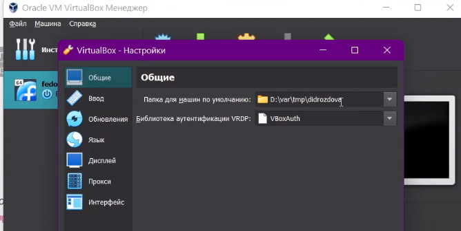{width=70%}
   
   - Устанавливаем новое значение, D:/var/tmp/didrozdova.
   - Нажимаем *ОК*, чтобы сохранить изменения.

3. **Настройка хост-клавиши**
   Настроить хост-клавишу для вм можно либо через терминал, либо через графический интерфейс вм. В данной лабораторной работе я воспользуюсь вторым вариантом:
   - В меню выбираем *Файл*, *Настройки*.
   - Выбираем *Ввод*, вкладка *Виртуальная машина*.
   - Выбираем *Сочетание клавиш* в строке *Хост-комбинация*.
   - Нажимаем *новое сочетание клавиш*.
   
   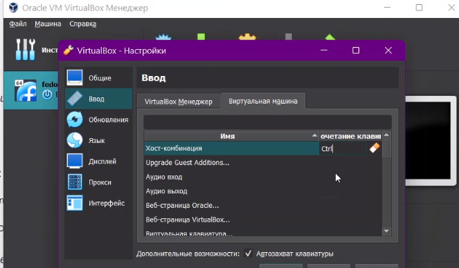{width=70%}
   
   - Нажимаем *ОК*, чтобы сохранить изменения.
   
4. **Создание виртуальной машины**
   - Создаем новую виртуальную машину.
   - Указываем имя виртуальной машины (логин в дисплейном классе), тип операционной системы — Linux, Fedora.
   
   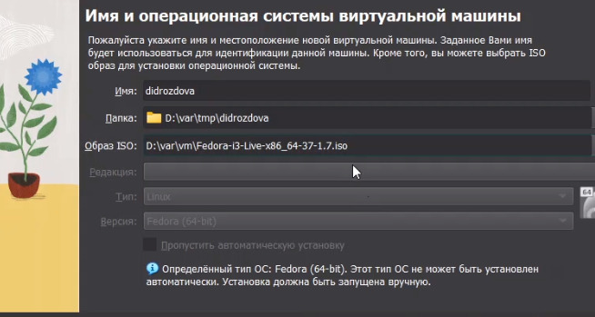{width=70%}
   
   - Указываем размер основной памяти виртуальной машины — от 2048 МБ.
   
   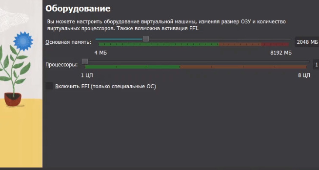{width=70%}
   
   - Задаем конфигурацию жёсткого диска — загрузочный, VDI (VirtualBox Disk Image), динамический виртуальный диск.
   - Задаем размер диска — 80 ГБ (или больше), его расположение — в данном случае D:/var/tmp/didrozdova/fedora.vdi.
   
   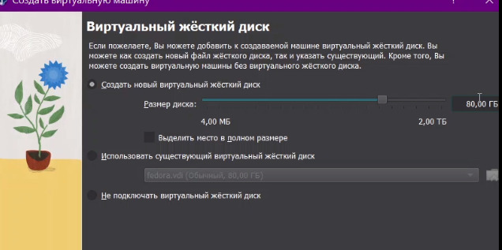{width=70%}
   
   - Запускаем виртуальную машину.
   
   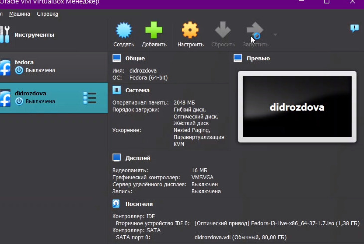{width=70%}
   
5. **Установка операционной системы**   
   - После загрузки LiveCD появится интерфейс начальной конфигурации.
   - Нажимаем Enter для создания конфигурации по умолчанию.
   
   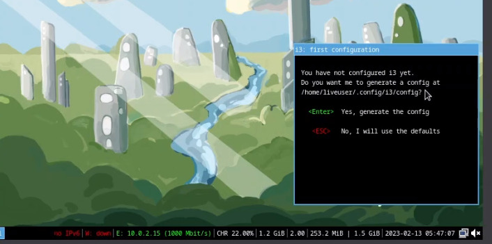{width=70%}
   
   - Нажимаем Enter, чтобы выбрать в качестве модификатора клавишу Win (она же клавиша Super).
   
   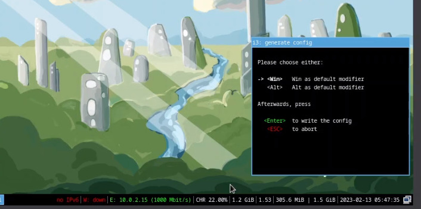{width=70%}
   
   - Нажимаем комбинацию Win+Enter для запуска терминала.
   - В терминале запускаем liveinst.
   
   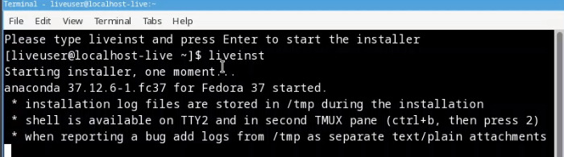{width=70%}

   - Выбираем язык интерфейса и переходим к настройкам установки операционной системы.
   
   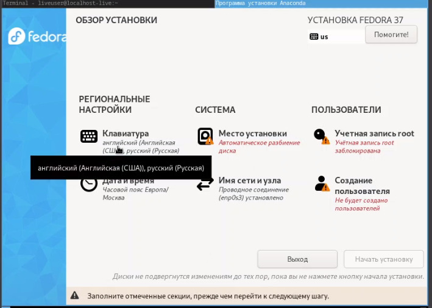{width=70%}
   
   - Место установки ОС - без изменения.
   - Устанавливаем имя и пароль для пользователя root.
   
   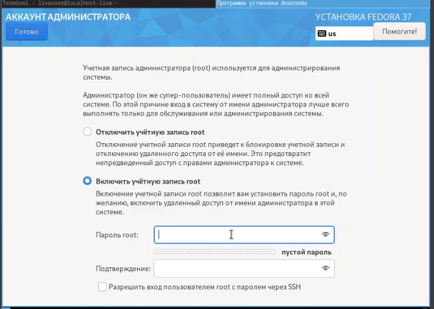{width=70%}
   
   - Устанавливаем имя и пароль для собственного пользователя.
   
   {width=70%}
   
   - После завершения установки операционной системы корректно перезапускаем виртуальную машину.
   
   - В VirtualBox выключаем носитель информации с образом.
   
   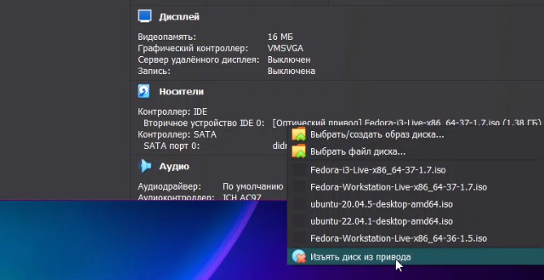{width=70%}
   

6. **Этапы после установки**
   - Обновляем все пакеты
   
   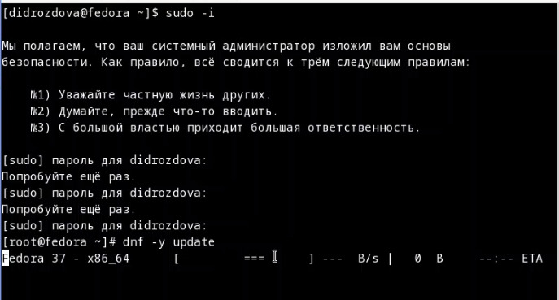{width=70%}
   
   - Устанавливаем программы для удобства работы в консоли
   
   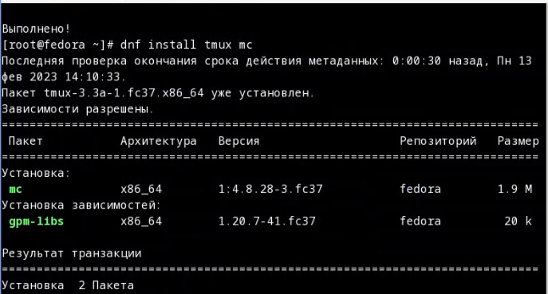{width=70%}
   
   - Установка программного обеспечения
   
   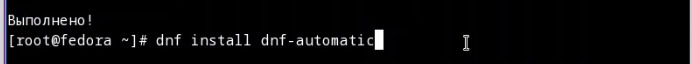{width=70%}
   
   - Запускаем таймер
   
   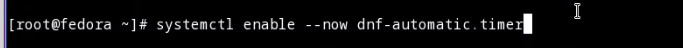{width=70%}
   
   - Отключаем SELinux, переходим в файл /etc/selinux/config и заменяем значение 
  SELINUX=enforcing
  на значение
  SELINUX=permissive
  
   {width=70%}
   
   {width=70%}
   
   - Перезагружаем вм командой *reboot*.
   
7. **Установка драйверов для VirtualBox**
   - Входим в ОС под заданной при установке учётной записью, запускаем терминальный мультиплексор tmux, переключаемся на роль супер-пользователя и устанавливаем пакет DKMS:
   
   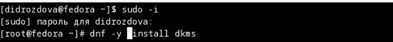{width=70%}
 
   - Монтируем диск и устанавливаем драйвера 
   
   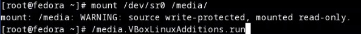{width=70%}
   
   - Перезагружаем систему командой *reboot*.
   
8. **Настройка раскладки клавиатуры**
   - Переключимся на роль супер-пользователя и отредактируем конфигурационный файл /etc/X11/xorg.conf.d/00-keyboard.conf
   
   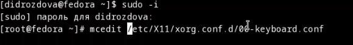{width=70%}
   
   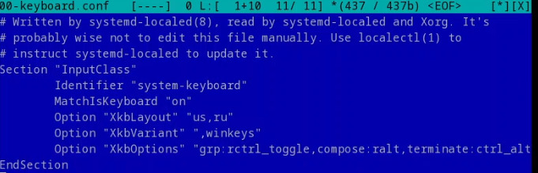{width=70%}
   
9. **Установка названия хоста** 
   - Переключаемся на роль супер-пользователя и устанавливаем имя хоста
   
   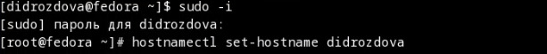{width=70%}
   
   - Проверяем, что имя хоста установлено успешно
   
   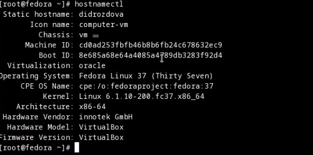{width=70%}
 
10. **Установка программного обеспечения для создания документации**
   - Установим pandoc
   
   {width=70%}
   
   - Установим дистрибутив TeXlive
   
   {width=70%}
 
 11. **Домашнее задание**
   - Версия ядра Linux (Linux version).
   
   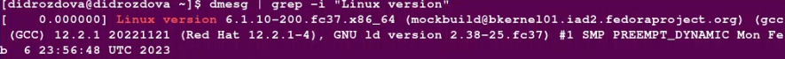{width=70%}
   
   - Частота процессора (Detected Mhz processor).
   
   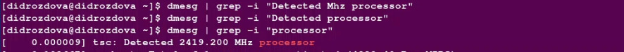{width=70%}
   
   - Модель процессора (CPU0).
   
   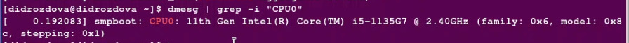{width=70%}
   
   - Объём доступной оперативной памяти (Memory available).
   
   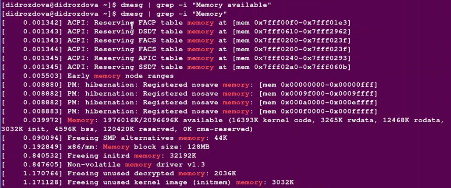{width=70%}
   
   - Тип обнаруженного гипервизора (Hypervisor detected).
   
   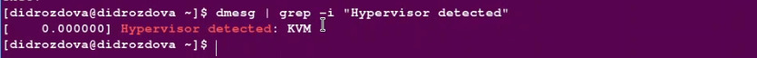{width=70%}
   
   - Тип файловой системы корневого раздела.
   
   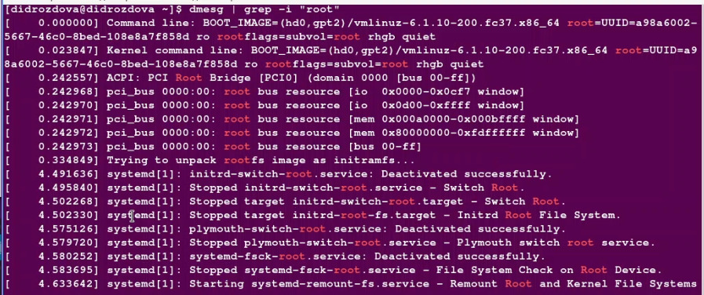{width=70%}
   
   - Последовательность монтирования файловых систем.
   
   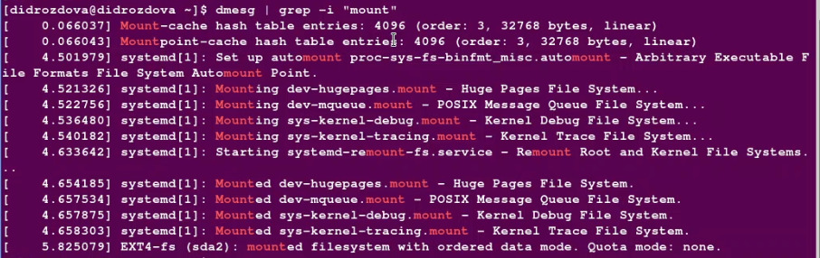{width=70%}
   
# Выводы

В ходе выполнения данной лабораторной работы мы приобрели практические навыки установки операционной системы на виртуальную машину, а также настроили минимально необходимые для дальнейшей работы сервисы.

# Ответы на вопросы
1. Какую информацию содержит учётная запись пользователя?
  - Системное имя (user name)
  - Идентификатор пользователя (UID):
Linux связывает системное имя c идентификатором пользователя в системе — User ID
  - Идентификатор группы (GID)
  - Полное имя (full name)
  - Домашний каталог (home directory)
  - Начальная оболочка (login shell)
2. Укажите команды терминала и приведите примеры
  - для получения справки по команде:
  *--help* или *-h*
  **Пример:**
  *git -h*
  
  - для перемещения по файловой системе:
  *cd*
  **Пример:**
  *cd ~/work/study/2022-2023/Операционные системы/study_2022-2023_os-intro/labs/lab01*
  
  - для просмотра содержимого каталога:
  *ls [-ключ]*
  **Пример:**
  *ls -a*

  - для определения объёма каталога:
  *du*
  **Пример:**
  *du -sh ~/work*

  - для создания / удаления каталогов / файлов:
  *touch file.txt*
  *mkdir ~/work/os_intro*
  *rm ~/work/os_intro/file.txt*
  
  - для задания определённых прав на файл / каталог:
  *chmod [ключ] [путь]*
  **Пример:**
  *chmod g + wx ~/Документы/hello.txt*
  
  - для просмотра истории команд:
  *history*
  **Пример:**
  *history*
  
3. Что такое файловая система? Приведите примеры с краткой характеристикой
Файловую систему можно представить состоящей из четырех основных компонентов:
  - пространство имен — методы именования объектов и организации их в виде единой иерархии
  - API2 — набор системных вызовов для перемещения между объектами и управления ими
  - модель безопасности — схема защиты, сокрытия и совместного использования объектов
  - реализация — программный код, который связывает логические модели с дисковой подсистемой
  - типы: сетевые (Network File System — NFS), межсетевые (Common Internet File System — CIFS),  ext3, ext4, ReiserFS, JFS, ZFC, VxFS, Btrfs, FAT, NTFS, 9660.

5. Как удалить зависший процесс?
  - использовать команду *reset* или *stty sane*

# Список литературы{.unnumbered}

::: Немет Э. et al. Unix и Linux: руководство системного администратора. 4-е изд. Вильямс, 2014. 1312 p. {#refs}
:::
