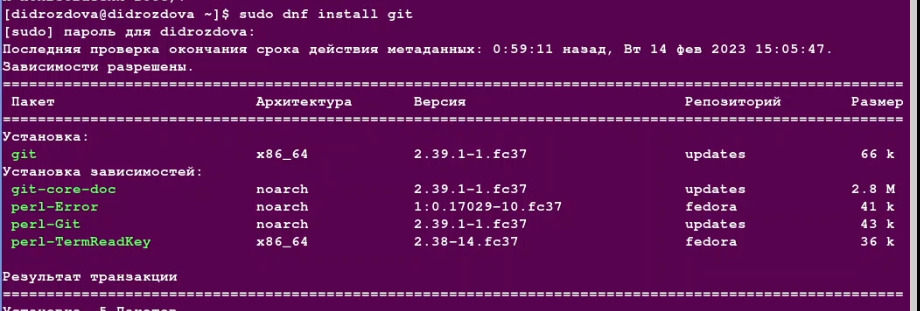
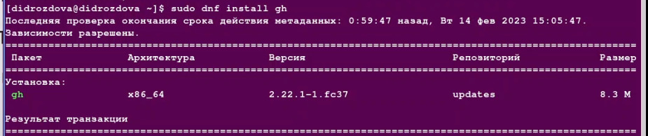
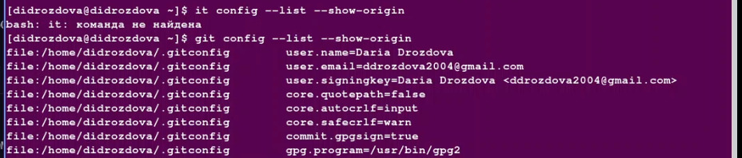
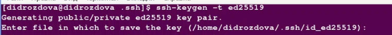
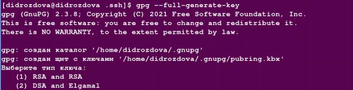
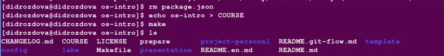

---
## Front matter
title: "Лабораторная работа №2"
subtitle: "'Операционные системы'"
author: "Дроздова Дарья Игоревна"

## Generic otions
lang: ru-RU
toc-title: "Содержание"

## Bibliography
bibliography: bib/cite.bib
csl: pandoc/csl/gost-r-7-0-5-2008-numeric.csl

## Pdf output format
toc: true # Table of contents
toc-depth: 2
lof: true # List of figures
fontsize: 12pt
linestretch: 1.5
papersize: a4
documentclass: scrreprt
## I18n polyglossia
polyglossia-lang:
  name: russian
  options:
	- spelling=modern
	- babelshorthands=true
polyglossia-otherlangs:
  name: english
## I18n babel
babel-lang: russian
babel-otherlangs: english
## Fonts
mainfont: PT Serif
romanfont: PT Serif
sansfont: PT Sans
monofont: PT Mono
mainfontoptions: Ligatures=TeX
romanfontoptions: Ligatures=TeX
sansfontoptions: Ligatures=TeX,Scale=MatchLowercase
monofontoptions: Scale=MatchLowercase,Scale=0.9
## Biblatex
biblatex: true
biblio-style: "gost-numeric"
biblatexoptions:
  - parentracker=true
  - backend=biber
  - hyperref=auto
  - language=auto
  - autolang=other*
  - citestyle=gost-numeric
## Pandoc-crossref LaTeX customization
figureTitle: "Рис."
tableTitle: "Таблица"
listingTitle: "Листинг"
lofTitle: "Список иллюстраций"
lotTitle: "Список таблиц"
lolTitle: "Листинги"
## Misc options
indent: true
header-includes:
  - \usepackage{indentfirst}
  - \usepackage{float} # keep figures where there are in the text
  - \floatplacement{figure}{H} # keep figures where there are in the text
---

# Цель работы

Изучить идеологию и применение средств контроля версий, освоить умения по работе с git.

# Выполнение лабораторной работы

1. **Установка git**

   - Установим git(в моем случае гит был установлен заранее)
   
   {#fig: width: 70%}

2. **Установка gh**

   {#fig: width: 70%}

3. **Базовая настройка git**

   - Зададим имя и email владельца репозитория и настроим utf-8 в выводе сообщений git:

     {#fig: width: 70%}

   - Настроим верификацию и подписание коммитов git (в моем случае подписание коммитов настроено, проверим командой):
   
   {#fig: width: 70%}

4. **Создайте ключи ssh**

   - по алгоритму rsa с ключём размером 4096 бит:

   {#fig: width: 70%}

   - по алгоритму ed25519:

   {#fig: width: 70%}

5. **Создайте ключи pgp**

   - Генерируем ключ

   {#fig: width: 70%}

   - Из предложенных опций выбираем:
   тип RSA and RSA;
   размер 4096;
   выберите срок действия; значение по умолчанию — 0 (срок действия не истекает никогда).
   GPG запросит личную информацию, которая сохранится в ключе:
   Имя (не менее 5 символов).
   Адрес электронной почты.
   При вводе email убедитесь, что он соответствует адресу, используемому на GitHub.
   Комментарий. Можно ввести что угодно или нажать клавишу ввода, чтобы оставить это поле пустым

6. **Настройка github**

   (в моем случае профиль на гитхабе уже имеется)

7. **Добавление PGP ключа в GitHub**

   - Выводим список ключей и копируем отпечаток приватного ключа:

   {#fig: width: 70%}

   Отпечаток ключа — это последовательность байтов, используемая для идентификации более длинного, по сравнению с самим отпечатком ключа.

   Формат строки:

   sec Алгоритм/Отпечаток*ключа Дата*создания [Флаги] [Годен_до]
   ID_ключа

   - Cкопируем сгенерированный PGP ключ в буфер обмена:

   {#fig: width: 70%}

   - Перейдем в настройки GitHub (https://github.com/settings/keys), нажмем на кнопку New GPG key и вставим полученный ключ в поле ввода.

8. **Настройка автоматических подписей коммитов git**

   - Используя введёный email, указываем Git применять его при подписи коммитов:

   {#fig: width: 70%}

9. **Настройка gh**

   - Для начала необходимо авторизоваться
   
   {#fig: width: 70%}

   Утилита задаст несколько наводящих вопросов.
   Авторизоваться можно через браузер.

10. **Создание репозитория курса на основе шаблона**

  - Необходимо создать шаблон рабочего пространства (в моем случае рабочее пространство уже было создано).

12. **Настройка каталога курса**

  - Перейдем в каталог курса, удалим лишние файлы, создадим необходимые каталоги и отправим файлы на сервер:
  
  {#fig: width: 70%}

# Выводы

В ходе выполнения данной лабораторной работы я приобрела теоретические навыки работы контролем версий, а также освоила базовые умения взаимодействия с распределённой системой управления версиями git.

# Ответы на вопросы

1. Что такое системы контроля версий (VCS) и для решения каких задач они предназначаются?

- Контроль версий, также известный как управление исходным кодом, — это практика отслеживания изменений программного кода и управления ими. Системы контроля версий — это программные инструменты, помогающие командам разработчиков управлять изменениями в исходном коде с течением времени.

2. Объясните следующие понятия VCS и их отношения: хранилище, commit, история, рабочая копия.

- Хранилище версий - репозиторий - в нем хранятся все документы вместе с историей их изменения и другой служебной информацией.
- Commit - команда совершающая выгрузку проиндексированных файлов в репозиторий
- История - история ваших последовательных коммитов
- Рабочая копия - копия основного рабочего репозитория на ваше локальное хранилище

3. Что представляют собой и чем отличаются централизованные и децентрализованные VCS? Приведите примеры VCS каждого вида.

- Централизованные VCS: одно основное хранилище всего проекта, каждый пользователь копирует себе необходимые ему
  файлы из этого репозитория, изменяет и, затем, добавляет свои изменения обратно, примеры: Subversion, CVS
- Децентрализованные VCS: У каждого пользователя свой вариант (возможно не один) репозитория, Присутствует возможность добавлять и забирать изменения из любого репозитория, примеры: Git, Mercurial

4. Опишите действия с VCS при единоличной работе с хранилищем.

- Создание репозитория на распределенном VCS и последовательное ведение проекта(pet-проета, коммерческого) во-первых, для создания активного профиля в качестве портфолио, во-вторых, возможность откатиться в случае появления критической ошибки в проекте или тупиковой ветви развития, в-третьих, возможность привлечения иных разработчиков, за счет понимании истории вашего проекта и возможности скопировать репозиторий.

5. Опишите порядок работы с общим хранилищем VCS.

- инициализировать, создать первый коммит, по мере работы(важные части проекта) выгружать обновленные файлы проекта

6. Каковы основные задачи, решаемые инструментальным средством git?

- Поддерживается автономная работа; локальные фиксации изменений могут быть отправлены позже. Каждое рабочее дерево в Git содержит хранилище с полной историей проекта. Ни одно хранилище Git не является по своей природе более важным, чем любое другое. Скорость работы, ветвление делается быстро и легко.

7. Назовите и дайте краткую характеристику командам git.

- Зададие имени и email владельца репозитория: git config --global user.name "Name Surname"; git config --global user.email "work@mail"
- Настройка utf-8 в выводе сообщений git: git config --global core.quotepath false
- Зададание имени начальной ветки (будем называть её master): git config --global init.defaultBranch master
- Параметр autocrlf: git config --global core.autocrlf input
- Параметр safecrlf: git config --global core.safecrlf warn
- Настройка автоматических подписей коммитов git: git config --global user.signingkey PGP Fingerprint; git config --global commit.gpgsign true; git config --global gpg.program $(which gpg2)
- Отправка файлов на сервер: git add .; git commit -am 'feat(main): make course structure'; git push

8. Приведите примеры использования при работе с локальным и удалённым репозиториями.

- см. предыдущие впр под №7, №5, №4

9. Что такое и зачем могут быть нужны ветви (branches)?

- Ветви нужны для командного взаимодействия в основном с удаленным репозиториями при распределении задач между разработчиками занимающимися разными задачами, но решающими их в рамках данного репозитория. Разработчики создают ветку в репозитория на удаленном хранилище(Github например) беря копию репозитория, обычно при этом ветка называется по тому с какой задачей работает разработчик. В дальнейшем выгрузка обновлений происходит на эту ветку с локального репозитория, а уже с нее обновления отправляют в main.

10. Как и зачем можно игнорировать некоторые файлы при commit?

- Ваши выбранные файлы, которые не нужно отслеживать, помещаются в специальную папку "git-ignore" и при обновлении этих файлов они не будут отправляться в репозиторий.

# Список литературы

1. Немет Э. et al. Unix и Linux: руководство системного администратора. 4-е изд. Вильямс, 2014. 1312 p.
