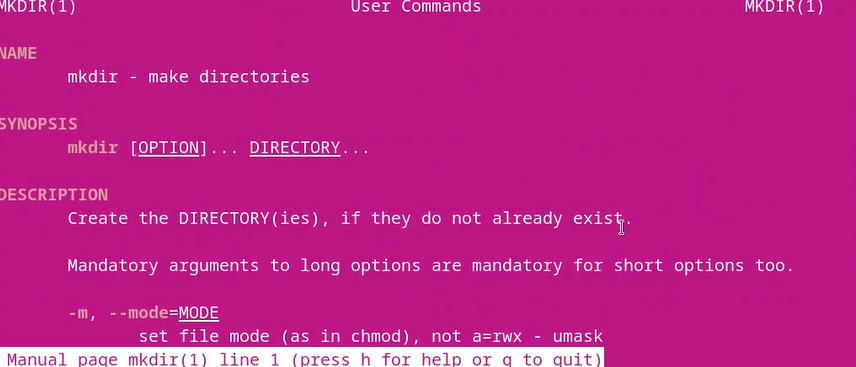

---
## Front matter
lang: ru-RU
title: Лабораторная работа №4
subtitle: Операционные системы
author:
  - Дроздова Д. И.
institute:
  - Российский университет дружбы народов, Москва, Россия
date: 03.03.2023

## i18n babel
babel-lang: russian
babel-otherlangs: english

## Formatting pdf
toc: false
toc-title: Содержание
slide_level: 2
aspectratio: 169
section-titles: true
theme: metropolis
header-includes:
 - \metroset{progressbar=frametitle,sectionpage=progressbar,numbering=fraction}
 - '\makeatletter'
 - '\beamer@ignorenonframefalse'
 - '\makeatother'
---

# Информация

## Докладчик

  * Дроздова Дарья Игоревна
  * студентка НБИ-01-22
  * Российский университет дружбы народов

# Вводная часть

## Цели и задачи

- Приобретение практических навыков взаимодействия пользователя с системой посредством командной строки

# Выполнение лабораторной работы

## Шаг 1

- Определите полное имя вашего домашнего каталога.

{#fig:02 width=70%}

## Шаг 2

- Перейдите в каталог /tmp и выведите на экран содержимое каталога /tmp. Для этого используйте команду ls с различными опциями. 

## без ключа
  
{#fig:03 width=70%}  
  
## ключ -a

{#fig:04 width=70%}  
  
## ключ -l

{#fig:05 width=70%}

## Шаг 3

  - Перейдите в Ваш домашний каталог и выведите на экран его содержимое. 

{#fig:07 width=70%}

## Шаг 4

  - В домашнем каталоге создайте новый каталог с именем ~/newdir/morefun.

{#fig:08 width=70%}

## Шаг 5

  - В домашнем каталоге создайте одной командой три новых каталога с именами letters, memos, misk. Затем удалите эти каталоги одной командой.

{#fig:09 width=70%}

## Шаг 6

  - Используйте команду man для просмотра описания следующих команд: cd, pwd, mkdir, rmdir, rm. Поясните основные опции этих команд.  
  
## перемещение по каталогам

{#fig:14 width=70%}  
  
## создание каталога

{#fig:15 width=70%}  
  
## путь текущей директории
  
{#fig:16 width=70%}  

## удаление файла

{#fig:17 width=70%}  
  
## удаление каталога

{#fig:18 width=70%}   
  
# Результаты

## Результаты

- мы приобрели практические навыки взаимодействия пользователя с системой посредством командной строки

