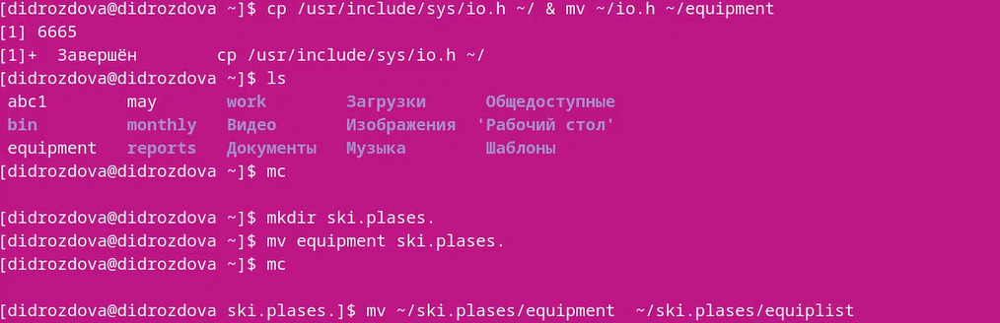
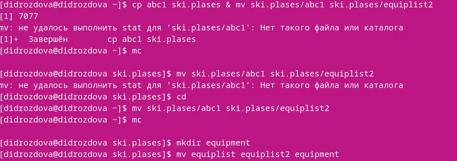
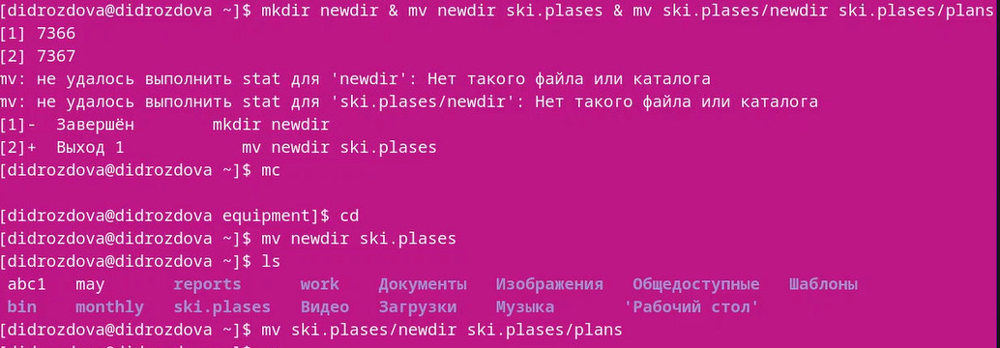
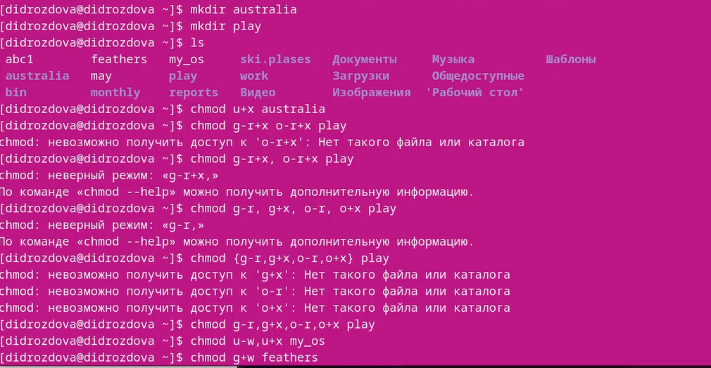
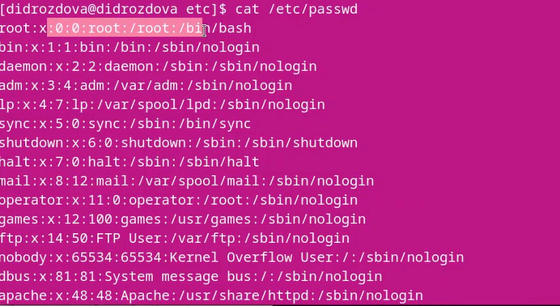
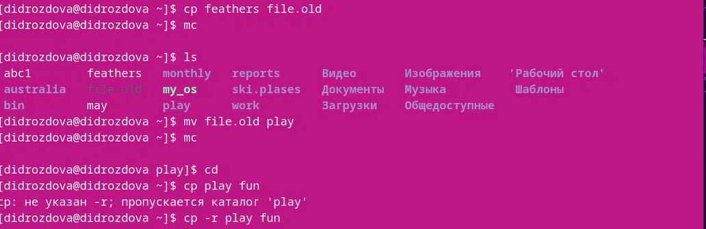
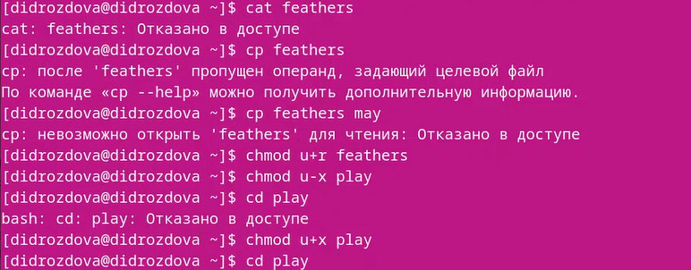

---
## Front matter
lang: ru-RU
title: Лабораторная работа №5
subtitle: Операционные системы
author:
  - Дроздова Д. И.
institute:
  - Российский университет дружбы народов, Москва, Россия
date: 11.03.2023

## i18n babel
babel-lang: russian
babel-otherlangs: english

## Formatting pdf
toc: false
toc-title: Содержание
slide_level: 2
aspectratio: 169
section-titles: true
theme: metropolis
header-includes:
 - \metroset{progressbar=frametitle,sectionpage=progressbar,numbering=fraction}
 - '\makeatletter'
 - '\beamer@ignorenonframefalse'
 - '\makeatother'
---

# Информация

## Докладчик

  * Дроздова Дарья Игоревна
  * студентка НБИ-01-22
  * Российский университет дружбы народов

# Вводная часть

## Цели и задачи

  - ознакомление с файловой системой Linux, её структурой, именами и содержанием каталогов
  - приобретение практических навыков по применению команд для работы с файлами и каталогами, по управлению процессами (и работами), по проверке использования диска и обслуживанию файловой системы

# Задания

1. Выполнение примеров, приведённых в первой части описания лабораторной работы.
2. Выполнение основной части лабораторной работы. 

# Выполнение лабораторной работы

## Шаг 1

  - Копируем файл /usr/include/sys/io.h в домашний каталог и называем его equipment. В домашнем каталоге создаем директорию ~/ski.plases и перемещаем в нее файл equipment. Переименовываем файл ~/ski.plases/equipment в ~/ski.plases/equiplist: 
  
{#fig:001 width=70%}

## Шаг 2

  - Создаем в домашнем каталоге файл abc1 и копируем его в каталог
~/ski.plases, называем его equiplist2. Создаем каталог с именем equipment в каталоге ~/ski.plases. Перемещаем файлы ~/ski.plases/equiplist и equiplist2 в каталог ~/ski.plases/equipment: 

{#fig:001 width=70%}
  
## Шаг 3
  
  - Создаем и перемещаем каталог ~/newdir в каталог ~/ski.plases и назовите
его plans:
 
 {#fig:001 width=70%}
  
## Шаг 4

  - Определяем опции команды chmod, необходимые для того, чтобы присвоить перечисленным ниже файлам выделенные права доступа:  
3.1. drwxr--r-- ... australia  
3.2. drwx--x--x ... play  
3.3. -r-xr--r-- ... my_os  
3.4. -rw-rw-r-- ... feathers  

{#fig:001 width=70%}

  
## Шаг 5

  - Просмотрим содержимое файла /etc/password.
  
{#fig:001 width=70%}

## Шаг 6

  - Скопируем файл ~/feathers в файл ~/file.old. Переместим файл ~/file.old в каталог ~/play. Скопируем каталог ~/play в каталог ~/fun. 
  
{#fig:001 width=70%}
  
## Шаг 7

  - Переместим каталог ~/fun в каталог ~/play и назовите его games. Лишим владельца файла ~/feathers права на чтение. Даем владельцу файла ~/feathers право на чтение. Лишаем владельца каталога ~/play права на выполнение. Даем владельцу каталога ~/play право на выполнение:
  
{#fig:001 width=70%}

## Шаг 8

 *Читаем man по командам mount, fsck, mkfs, kill:*
 - mount — утилита командной строки в UNIX-подобных операционных системах. Применяется для монтирования файловых систем.
 - fsck — (проверка файловой системы) - это утилита командной строки, которая позволяет выполнять проверки согласованности и интерактивное исправление в одной или нескольких файловых системах Linux.
 - mkfs — используется для создания файловой системы Linux на некотором устройстве, обычно в разделе жёсткого диска.
 - kill — является встроенной командой командной оболочки, предназначенной для отправки системных сигналов определенным процессам. 
 
# Результаты

## Результаты

В ходе выполнения данной лабораторной работы мы ознакомились с файловой системой Linux, её структурой, именами и содержанием каталогов и приобрели практические навыки по применению команд для работы с файлами и каталогами.

