---
## Front matter
title: "Лабораторная работа №5"
subtitle: "Операционные системы"
author: "Дарья Игоревна Дроздова"

## Generic otions
lang: ru-RU
toc-title: "Содержание"

## Bibliography
bibliography: bib/cite.bib
csl: pandoc/csl/gost-r-7-0-5-2008-numeric.csl

## Pdf output format
toc: true # Table of contents
toc-depth: 2
lof: true # List of figures
lot: false # List of tables
fontsize: 12pt
linestretch: 1.5
papersize: a4
documentclass: scrreprt
## I18n polyglossia
polyglossia-lang:
  name: russian
  options:
	- spelling=modern
	- babelshorthands=true
polyglossia-otherlangs:
  name: english
## I18n babel
babel-lang: russian
babel-otherlangs: english
## Fonts
mainfont: PT Serif
romanfont: PT Serif
sansfont: PT Sans
monofont: PT Mono
mainfontoptions: Ligatures=TeX
romanfontoptions: Ligatures=TeX
sansfontoptions: Ligatures=TeX,Scale=MatchLowercase
monofontoptions: Scale=MatchLowercase,Scale=0.9
## Biblatex
biblatex: true
biblio-style: "gost-numeric"
biblatexoptions:
  - parentracker=true
  - backend=biber
  - hyperref=auto
  - language=auto
  - autolang=other*
  - citestyle=gost-numeric
## Pandoc-crossref LaTeX customization
figureTitle: "Рис."
tableTitle: "Таблица"
listingTitle: "Листинг"
lofTitle: "Список иллюстраций"
lotTitle: "Список таблиц"
lolTitle: "Листинги"
## Misc options
indent: true
header-includes:
  - \usepackage{indentfirst}
  - \usepackage{float} # keep figures where there are in the text
  - \floatplacement{figure}{H} # keep figures where there are in the text
---
# Цель работы
  - ознакомление с файловой системой Linux, её структурой, именами и содержанием каталогов
  - приобретение практических навыков по применению команд для работы с файлами и каталогами, по управлению процессами (и работами), по проверке использования диска и обслуживанию файловой системы.

# Задания
1. Выполнение примеров, приведённых в первой части описания лабораторной работы.
2. Выполнение основной части лабораторной работы.

# Выполнение лабораторной работы
**Копирование, перемещение, переименование и изменение прав доступа**

1. *Практическая часть из описания лабораторной работы* 

  - Создаем файл abc1 в домашнем каталоге, копируем только что созданный файл в файл april и may. Создаем каталог monthly и копируем файлы april и may в этот каталог: 
  
  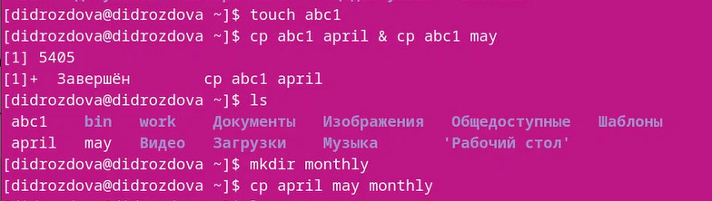{#fig:001 width=70%}

  - Скопируем  каталог monthly в каталог monthly.00 и каталог monthly.00 в каталог /tmp:
  
    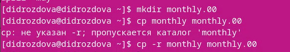{#fig:001 width=70%}
    
    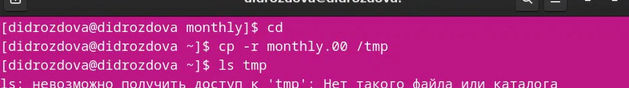{#fig:001 width=70%}
  
  - Меняем название файла april на july в домашнем каталоге.Перемещаем файл july в каталог monthly.00:
  
    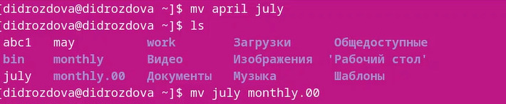{#fig:001 width=70%}
  
  - Переименовываем каталог monthly.00 в monthly.01.Перемещаем каталог monthly.01в каталог reports. Переименуем каталог reports/monthly.01 в reports/monthly:
  
  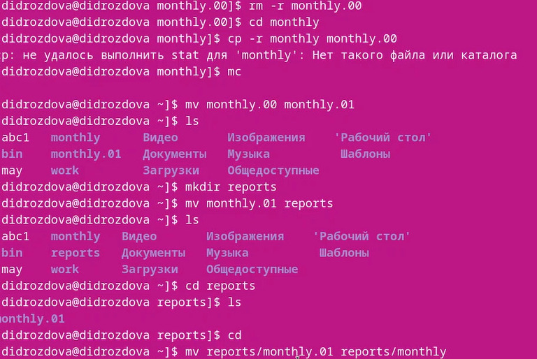{#fig:001 width=70%}
  
  - Создаем файл ~/may с правом выполнения для владельца на выполнение:
  
  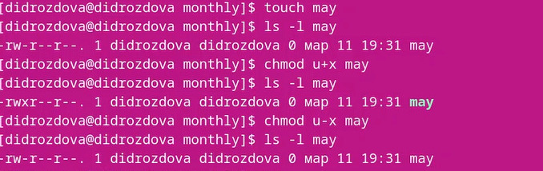{#fig:001 width=70%}
  
  - Лишаем владельца файла ~/may права на выполнение:
  
  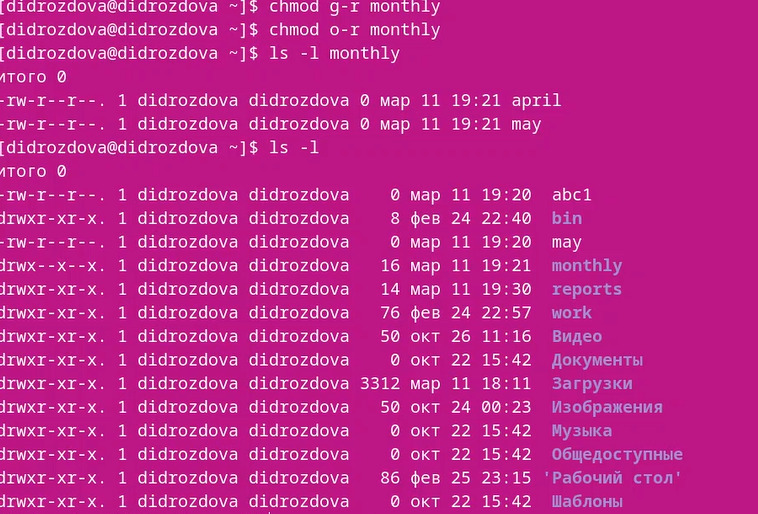{#fig:001 width=70%}
  
2. *Основная часть лабораторной работы*

  - Копируем файл /usr/include/sys/io.h в домашний каталог и называем его equipment. В домашнем каталоге создаем директорию ~/ski.plases и перемещаем в нее файл equipment. Переименовываем файл ~/ski.plases/equipment в ~/ski.plases/equiplist: 
  
  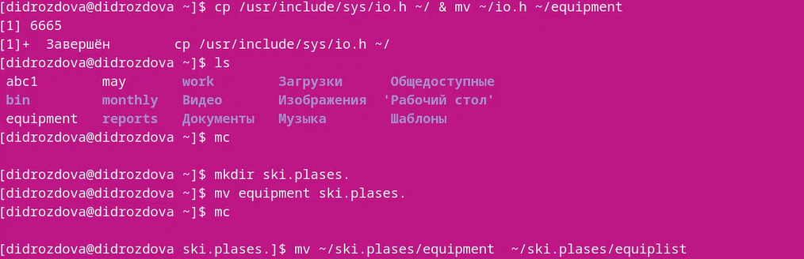{#fig:001 width=70%}
  
  - Создаем в домашнем каталоге файл abc1 и копируем его в каталог
~/ski.plases, называем его equiplist2. Создаем каталог с именем equipment в каталоге ~/ski.plases. Перемещаем файлы ~/ski.plases/equiplist и equiplist2 в каталог ~/ski.plases/equipment: 

  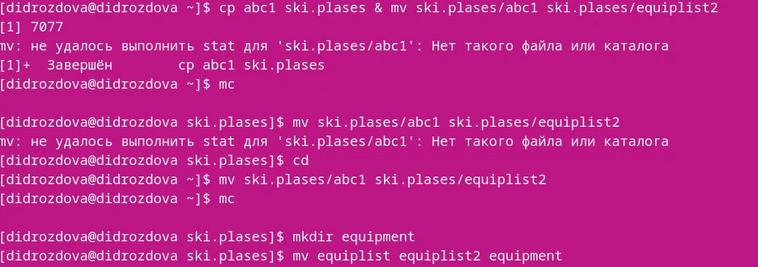{#fig:001 width=70%}
  
  - Создаем и перемещаем каталог ~/newdir в каталог ~/ski.plases и назовите
его plans:
 
 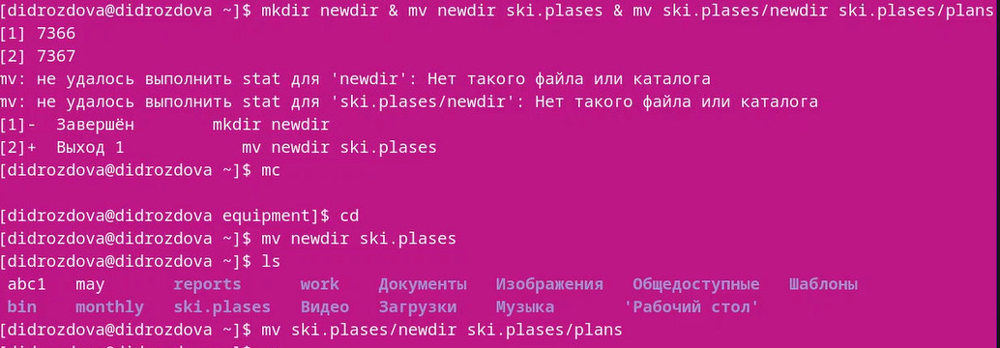{#fig:001 width=70%}
 
  - Определяем опции команды chmod, необходимые для того, чтобы присвоить перечисленным ниже файлам выделенные права доступа:  
3.1. drwxr--r-- ... australia  
3.2. drwx--x--x ... play  
3.3. -r-xr--r-- ... my_os  
3.4. -rw-rw-r-- ... feathers  

  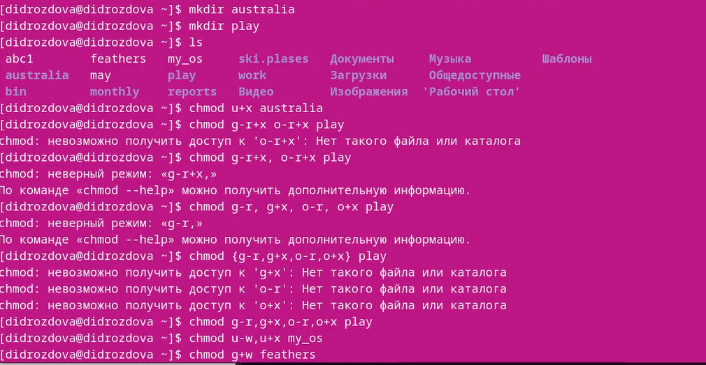{#fig:001 width=70%}
  
  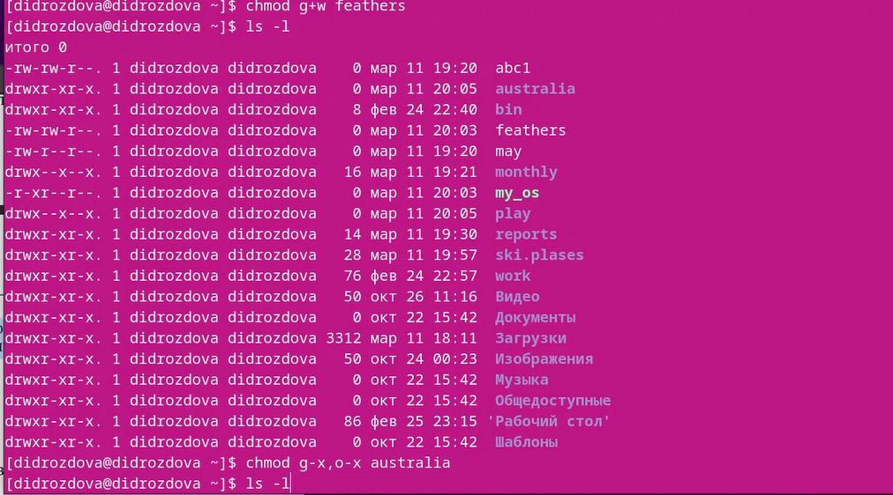{#fig:001 width=70%}

  - Просмотрим содержимое файла /etc/password.
  
  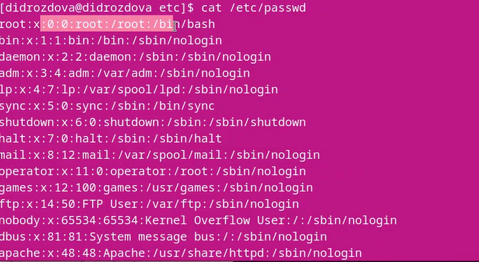{#fig:001 width=70%}
  
  - Скопируем файл ~/feathers в файл ~/file.old. Переместим файл ~/file.old в каталог ~/play. Скопируем каталог ~/play в каталог ~/fun. 
  
  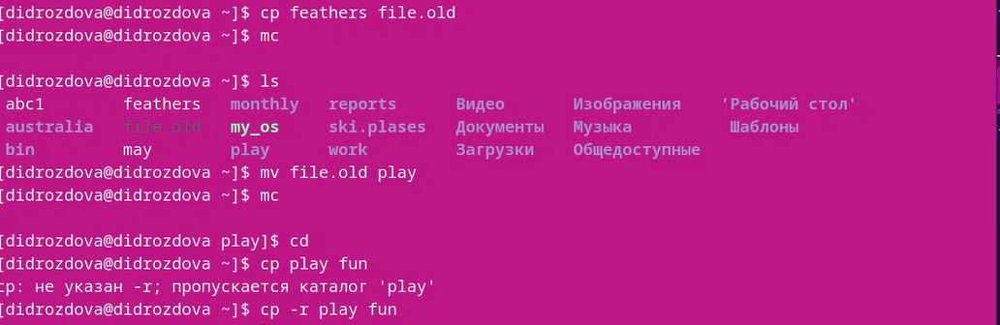{#fig:001 width=70%}

  - Переместим каталог ~/fun в каталог ~/play и назовите его games. Лишим владельца файла ~/feathers права на чтение. Даем владельцу файла ~/feathers право на чтение. Лишаем владельца каталога ~/play права на выполнение. Даем владельцу каталога ~/play право на выполнение:
  
  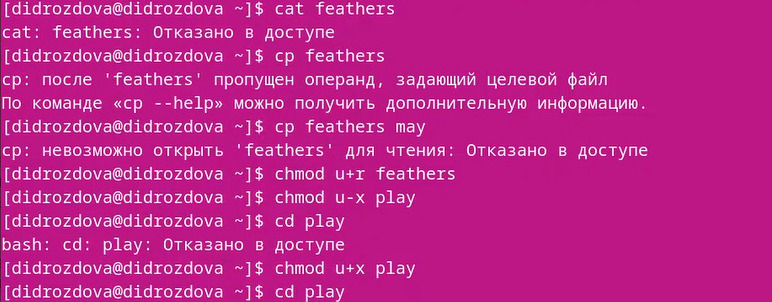{#fig:001 width=70%}

  - Читаем man по командам mount, fsck, mkfs, kill.
  
# Выводы
В ходе выполнения данной лабораторной работы мы ознакомились с файловой системой Linux, её структурой, именами и содержанием каталогов и приобрели практические навыки по применению команд для работы с файлами и каталогами.

