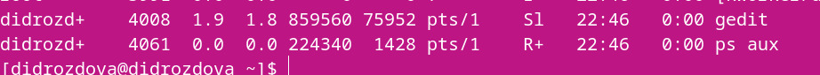

---
## Front matter
lang: ru-RU
title: Лабораторная работа №6
subtitle: Операционные системы
author:
  - Дроздова Д. И.
institute:
  - Российский университет дружбы народов, Москва, Россия
date: 18.03.2023

## i18n babel
babel-lang: russian
babel-otherlangs: english

## Formatting pdf
toc: false
toc-title: Содержание
slide_level: 2
aspectratio: 169
section-titles: true
theme: metropolis
header-includes:
 - \metroset{progressbar=frametitle,sectionpage=progressbar,numbering=fraction}
 - '\makeatletter'
 - '\beamer@ignorenonframefalse'
 - '\makeatother'
---

# Информация

## Докладчик

  * Дроздова Дарья Игоревна
  * студентка НБИ-01-22
  * Российский университет дружбы народов

# Вводная часть

## Цели и задачи

1. Ознакомление с инструментами поиска файлов и фильтрации текстовых данных.
2. Приобретение практических навыков: 
  - по управлению процессами (и заданиями), 
  - проверке использования диска,
  - по обслуживанию файловых систем.

# Задания

1. Выполнение примеров, приведённых в первой части описания лабораторной работы.
2. Выполнение основной части лабораторной работы. 

# Выполнение лабораторной работы

## Шаг 1

  - Запишите в файл file.txt названия файлов, содержащихся в каталоге /etc. Допишите в этот же файл названия файлов, содержащихся в вашем домашнем каталоге.
  
{#fig:001 width=70%}
  
{#fig:001 width=70%}

## Шаг 2

  - Выведите имена всех файлов из file.txt, имеющих расширение .conf, после чего запишите их в новый текстовой файл conf.txt.

{#fig:001 width=70%}
  
## Шаг 3
  
  - Определите, какие файлы в вашем домашнем каталоге имеют имена, начинавшиеся с символа c? 
 
 {#fig:001 width=70%}
  
## Шаг 4

  - Выведите на экран (по странично) имена файлов из каталога /etc, начинающиеся с символа h.

{#fig:001 width=70%}

  
## Шаг 5

  - Запустите в фоновом режиме процесс, который будет записывать в файл ~/logfile файлы, имена которых начинаются с log.
  
{#fig:001 width=70%}

## Шаг 6

  - Запустите из консоли в фоновом режиме редактор gedit.
  
{#fig:001 width=70%}
  
## Шаг 7

  - Определите идентификатор процесса gedit, используя команду ps, конвейер и фильтр grep. Как ещё можно определить идентификатор процесса?
  
{#fig:001 width=70%}

{#fig:001 width=70%}

## Шаг 8

  - Прочтите справку (man) команды kill, после чего используйте её для завершения процесса gedit.
  
{#fig:001 width=70%}  
 
## Шаг 9

  - Выполните команды df и du, предварительно получив более подробную информацию об этих командах, с помощью команды man.
  *df ~/*

{#fig:001 width=70%}  

## Шаг 9.1

*du ~/work*
 
{#fig:001 width=70%}
  
{#fig:001 width=70%}   

## Шаг 10

  - Воспользовавшись справкой команды find, выведите имена всех директорий, имеющихся в вашем домашнем каталоге.
  
{#fig:001 width=70%}

# Результаты

## Результаты

В ходе выполнения данной лабораторной работы мы ознакомились с инструментами поиска файлов и фильтрации текстовых данных и приобрели практические навыки по управлению процессами (и заданиями), по
проверке использования диска и обслуживанию файловых систем.

