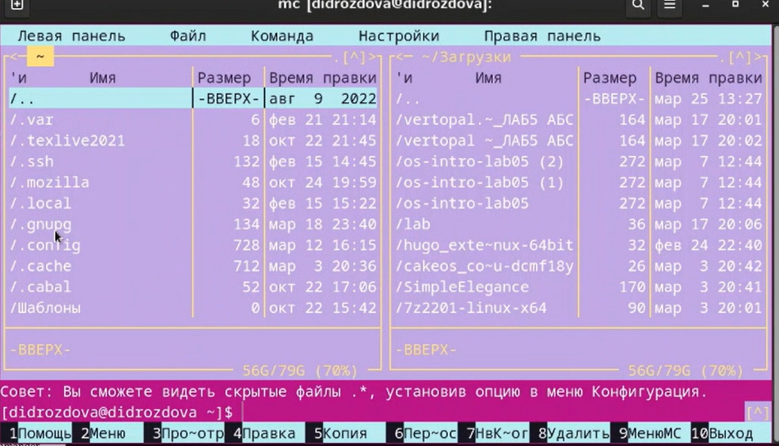
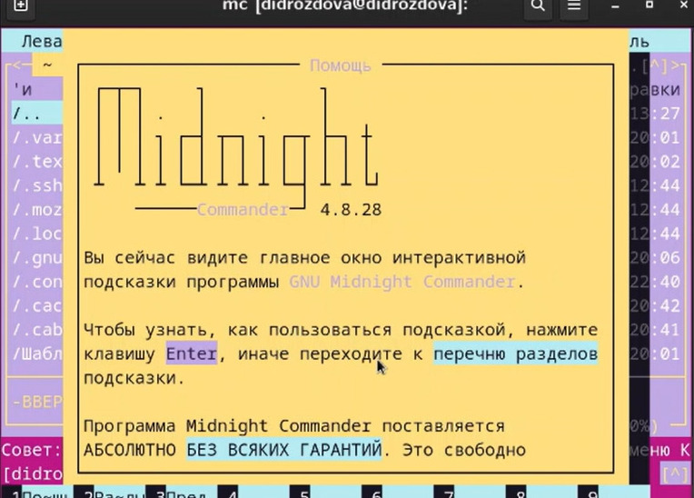
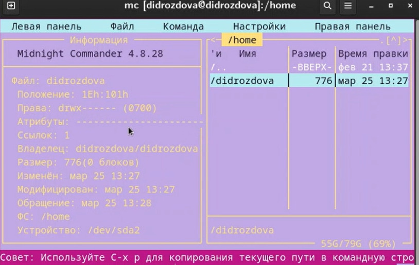
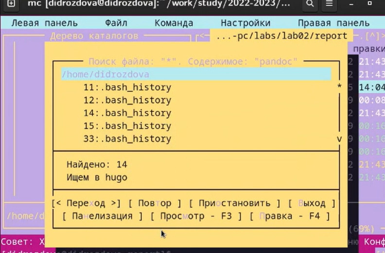
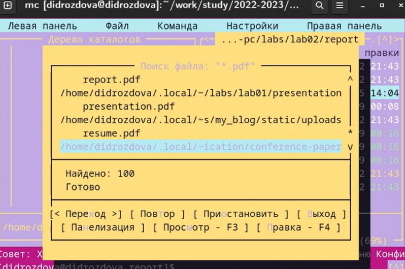
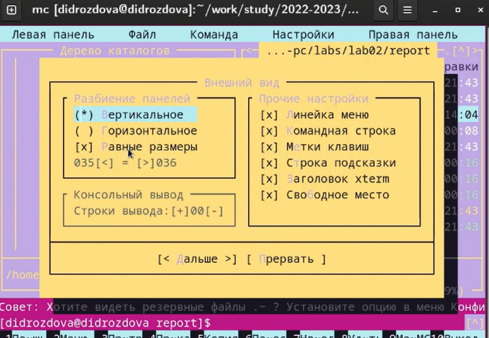
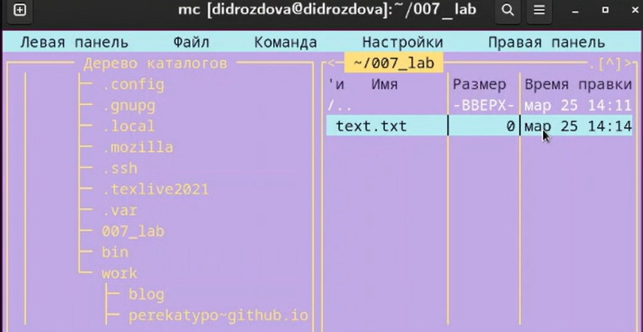
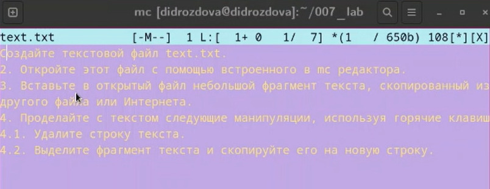
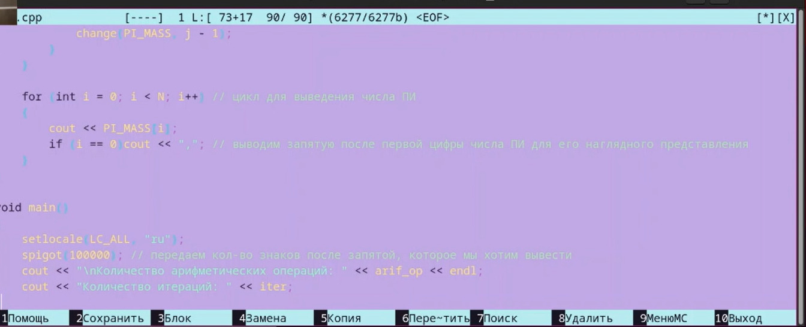
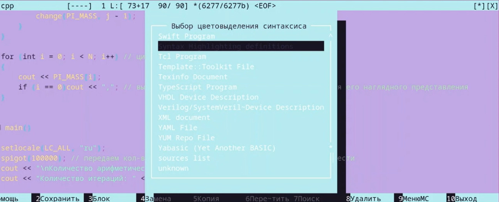

---
## Front matter
lang: ru-RU
title: Лабораторная работа №7
subtitle: Операционные системы
author:
  - Дроздова Д. И.
institute:
  - Российский университет дружбы народов, Москва, Россия
date: 25.03.2023

## i18n babel
babel-lang: russian
babel-otherlangs: english

## Formatting pdf
toc: false
toc-title: Содержание
slide_level: 2
aspectratio: 169
section-titles: true
theme: metropolis
header-includes:
 - \metroset{progressbar=frametitle,sectionpage=progressbar,numbering=fraction}
 - '\makeatletter'
 - '\beamer@ignorenonframefalse'
 - '\makeatother'
---

# Информация

## Докладчик

  * Дроздова Дарья Игоревна
  * студентка НБИ-01-22
  * Российский университет дружбы народов

# Вводная часть

## Цели и задачи

- Освоение основных возможностей командной оболочки Midnight Commander;
- Приобретение навыков практической работы по просмотру каталогов и файлов и по манипуляциям с ними.

# Задания

1. **Задание по mc**
2. **Задание по встроенному редактору mc**

# Выполнение лабораторной работы

## Шаг 1

  - Изучите информацию о mc, вызвав в командной строке man mc. Запустите из командной строки mc, изучите его структуру и меню:
  
{#fig:001 width=70%}
   
{#fig:001 width=70%}

## Шаг 2

  - Выполните несколько операций в mc, используя управляющие клавиши  
*операции с панелями:*  
*копирование/перемещение файлов*
*получение информации о размере и правах доступа на файлы и/или каталоги*
  
## Шаг 3
  
  - Выполните основные команды меню левой (или правой) панели. Оцените степень подробности вывода информации о файлах.
 
{#fig:001 width=70%}  
  
## Шаг 4

  - Используя возможности подменю Файл , выполните:
*просмотр содержимого текстового файла:*
*редактирование содержимого текстового файла (без сохранения результатов
редактирования)*
*создание каталога*
*копирование в файлов в созданный каталог*
  
## Шаг 5

  -  С помощью соответствующих средств подменю Команда осуществите:
  *поиск в файловой системе файла с заданными условиями: с расширением .pdf содержащего строку pandoc*
  
{#fig:001 width=70%}

{#fig:001 width=70%}

## Шаг 6

  - Вызовите подменю Настройки . Освойте операции, определяющие структуру экрана mc (Full screen, Double Width, Show Hidden Files и т.д.)
  
{#fig:001 width=70%}  
  
## Шаг 7

  - Создайте текстовой файл text.txt.
  
{#fig:001 width=70%}

## Шаг 8

  - Откройте этот файл с помощью встроенного в mc редактора. Вставьте в открытый файл небольшой фрагмент текста, скопированный из любого другого файла или Интернета.

{#fig:001 width=70%}
 
## Шаг 9

  - Проделайте с текстом следующие манипуляции, используя горячие клавиши:
*Удалите строку текста* 
*Выделите фрагмент текста и скопируйте его на новую строку*
*Выделите фрагмент текста и перенесите его на новую строку. Отмените последнее действие*
*Сохраните и закройте файл*

## Шаг 10

  - Откройте файл с исходным текстом на некотором языке программирования( в моем случае на языке С++)
  
{#fig:001 width=70%}

## Шаг 11

  - Используя меню редактора, включите подсветку синтаксиса, если она не включена, или выключите, если она включена
  
{#fig:001 width=70%}

# Результаты

## Результаты

В ходе выполнения данной лабораторной работы мы ознакомились с основными возможностями командной оболочки Midnight Commander и  приобрели практические навыки по просмотру каталогов и файлов и по манипуляциям с ними.

