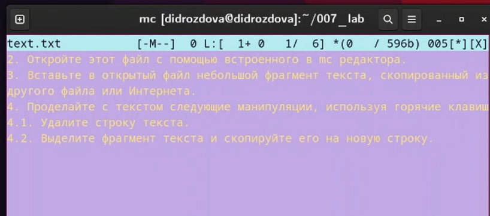
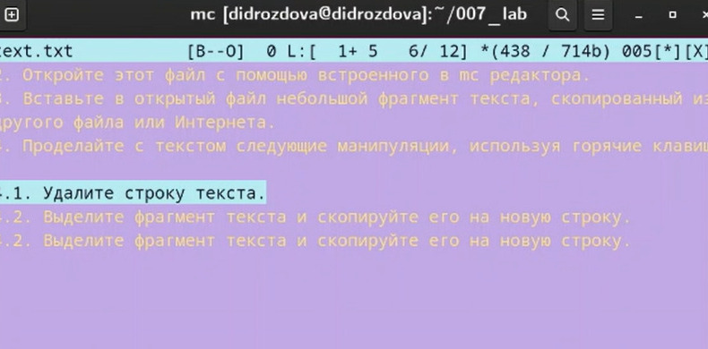

---
## Front matter
title: "Лабораторная работа №7"
subtitle: "Операционные системы"
author: "Дарья Игоревна Дроздова"

## Generic otions
lang: ru-RU
toc-title: "Содержание"

## Bibliography
bibliography: bib/cite.bib
csl: pandoc/csl/gost-r-7-0-5-2008-numeric.csl

## Pdf output format
toc: true # Table of contents
toc-depth: 2
lof: true # List of figures
lot: false # List of tables
fontsize: 12pt
linestretch: 1.5
papersize: a4
documentclass: scrreprt
## I18n polyglossia
polyglossia-lang:
  name: russian
  options:
	- spelling=modern
	- babelshorthands=true
polyglossia-otherlangs:
  name: english
## I18n babel
babel-lang: russian
babel-otherlangs: english
## Fonts
mainfont: PT Serif
romanfont: PT Serif
sansfont: PT Sans
monofont: PT Mono
mainfontoptions: Ligatures=TeX
romanfontoptions: Ligatures=TeX
sansfontoptions: Ligatures=TeX,Scale=MatchLowercase
monofontoptions: Scale=MatchLowercase,Scale=0.9
## Biblatex
biblatex: true
biblio-style: "gost-numeric"
biblatexoptions:
  - parentracker=true
  - backend=biber
  - hyperref=auto
  - language=auto
  - autolang=other*
  - citestyle=gost-numeric
## Pandoc-crossref LaTeX customization
figureTitle: "Рис."
tableTitle: "Таблица"
listingTitle: "Листинг"
lofTitle: "Список иллюстраций"
lotTitle: "Список таблиц"
lolTitle: "Листинги"
## Misc options
indent: true
header-includes:
  - \usepackage{indentfirst}
  - \usepackage{float} # keep figures where there are in the text
  - \floatplacement{figure}{H} # keep figures where there are in the text
---
# Цель работы

- Освоение основных возможностей командной оболочки Midnight Commander;
- Приобретение навыков практической работы по просмотру каталогов и файлов и по манипуляциям с ними.

# Выполнение лабораторной работы

1. **Задание по mc**
  - Изучите информацию о mc, вызвав в командной строке man mc. Запустите из командной строки mc, изучите его структуру и меню:
  
{#fig:001 width=70%}
   
{#fig:001 width=70%}
  
  - Выполните несколько операций в mc, используя управляющие клавиши  
*операции с панелями:*  

{#fig:001 width=70%}

*копирование/перемещение файлов*

{#fig:001 width=70%}

{#fig:001 width=70%}

{#fig:001 width=70%}

*получение информации о размере и правах доступа на файлы и/или каталоги*

{#fig:001 width=70%}
  
  - Выполните основные команды меню левой (или правой) панели. Оцените степень подробности вывода информации о файлах.
  
{#fig:001 width=70%}  
  
  - Используя возможности подменю Файл , выполните:
*просмотр содержимого текстового файла:*

{#fig:001 width=70%}

*редактирование содержимого текстового файла (без сохранения результатов
редактирования)*
*создание каталога*
*копирование в файлов в созданный каталог*

{#fig:001 width=70%}

  -  С помощью соответствующих средств подменю Команда осуществите:
  
  *поиск в файловой системе файла с заданными условиями: с расширением .pdf содержащего строку pandoc*

{#fig:001 width=70%}

{#fig:001 width=70%}

{#fig:001 width=70%}

  - Вызовите подменю Настройки . Освойте операции, определяющие структуру экрана mc (Full screen, Double Width, Show Hidden Files и т.д.)
  
{#fig:001 width=70%}  
  
2. **Задание по встроенному редактору mc**

  - Создайте текстовой файл text.txt.
  
{#fig:001 width=70%}

  - Откройте этот файл с помощью встроенного в mc редактора. Вставьте в открытый файл небольшой фрагмент текста, скопированный из любого другого файла или Интернета.

{#fig:001 width=70%}

  - Проделайте с текстом следующие манипуляции, используя горячие клавиши:
*Удалите строку текста* 

{#fig:001 width=70%}

*Выделите фрагмент текста и скопируйте его на новую строку*

{#fig:001 width=70%}

{#fig:001 width=70%}

*Выделите фрагмент текста и перенесите его на новую строку. Отмените последнее действие*

{#fig:001 width=70%}

*Сохраните и закройте файл*

{#fig:001 width=70%}

  - Откройте файл с исходным текстом на некотором языке программирования( в моем случае на языке С++)
  
{#fig:001 width=70%}
  
  - Используя меню редактора, включите подсветку синтаксиса, если она не включена, или выключите, если она включена
  
{#fig:001 width=70%}
  
  
# Выводы
В ходе выполнения данной лабораторной работы мы ознакомились с основными возможностями командной оболочки Midnight Commander и  приобрели практические навыки по просмотру каталогов и файлов и по манипуляциям с ними.
