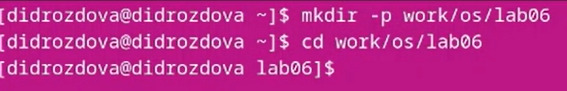
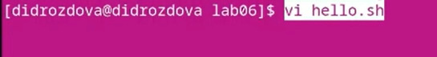
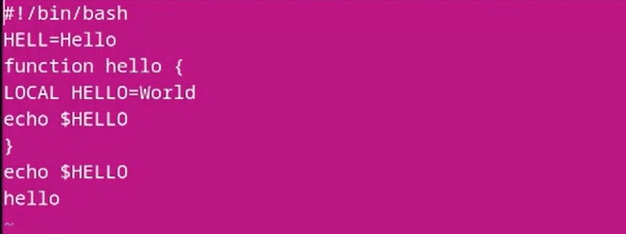
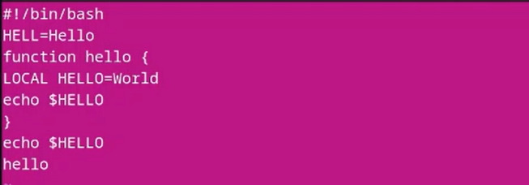
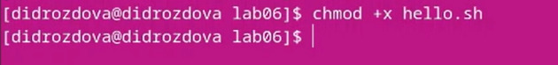
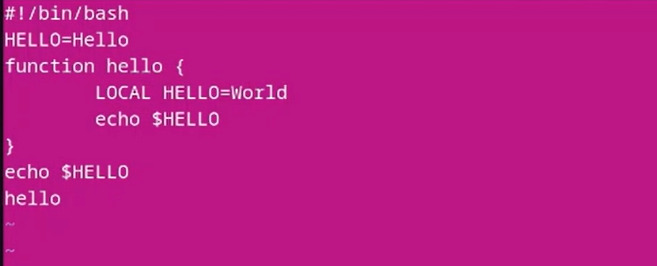
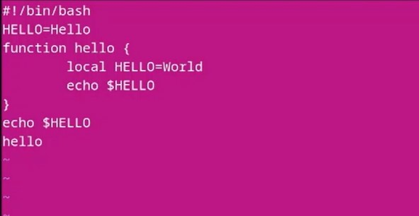
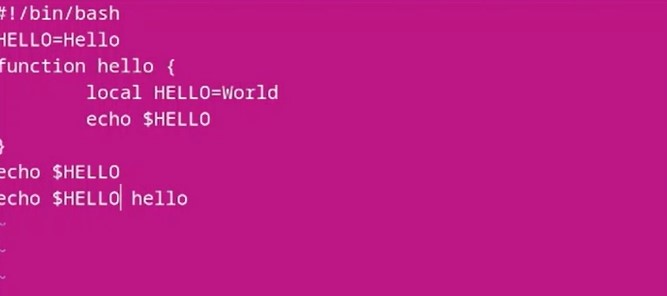
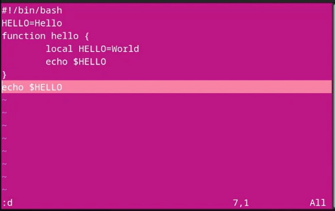
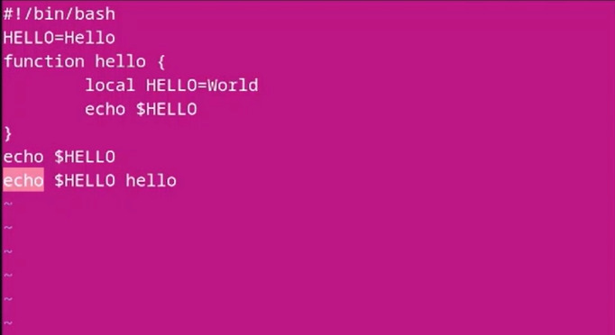

---
## Front matter
lang: ru-RU
title: Лабораторная работа №8
subtitle: Операционные системы
author:
  - Дроздова Д. И.
institute:
  - Российский университет дружбы народов, Москва, Россия
date: 01.04.2023

## i18n babel
babel-lang: russian
babel-otherlangs: english

## Formatting pdf
toc: false
toc-title: Содержание
slide_level: 2
aspectratio: 169
section-titles: true
theme: metropolis
header-includes:
 - \metroset{progressbar=frametitle,sectionpage=progressbar,numbering=fraction}
 - '\makeatletter'
 - '\beamer@ignorenonframefalse'
 - '\makeatother'
---

# Информация

## Докладчик

  * Дроздова Дарья Игоревна
  * студентка НБИ-01-22
  * Российский университет дружбы народов

# Вводная часть

## Цели и задачи

- Познакомиться с операционной системой Linux
- Получить практические навыки работы с редактором vi, установленным по умолчанию практически во всех дистрибутивах

# Задания

1. Ознакомиться с теоретическим материалом.
2. Ознакомиться с редактором vi.
3. Выполнить упражнения, используя команды vi.

# Выполнение лабораторной работы

## Шаг 1

  - Создайте каталог с именем ~/work/os/lab06 и перейдите в созданный каталог. Вызовите vi и создайте файл hello.sh:

{#fig:001 width=70%}
{#fig:001 width=70%}

## Шаг 2

  - Нажмите клавишу i и введите листинг, представленный в приложении к лабораторной работе:
  
{#fig:001 width=70%}  
  
## Шаг 3
  
  - Нажмите клавишу Esc для перехода в командный режим после завершения ввода текста; нажмите *:* для перехода в режим последней строки и внизу вашего экрана появится приглашение в виде двоеточия; нажмите w (записать) и q (выйти), а затем нажмите клавишу Enter для сохранения вашего текста и завершения работы.

{#fig:001 width=70%}
  
## Шаг 4

  - Сделайте файл исполняемым

{#fig:001 width=70%}
  
## Шаг 5

  -  Вызовите vi на редактирование файла, перейдите в режим вставки, нажав *i*, и замените на HELLO. Нажмите Esc для возврата в команд-
ный режим.:
  
{#fig:001 width=70%}

## Шаг 6

  - Установите курсор на четвертую строку и сотрите слово LOCAL, перейдите в режим вставки, нажав *i*, и наберите следующий текст: local, нажмите Esc для возврата в командный режим.

{#fig:001 width=70%}
  
## Шаг 7

  - Установите курсор на последней строке файла. Вставьте после неё строку, содержащую следующий текст: echo $HELLO, нажав *Enter ;* и *l*:

{#fig:001 width=70%}

## Шаг 8

  - Нажмите Esc для перехода в командный режим, удалите последнюю строку, выделив строку курсором и нажав *Enter ;* и *d*:
  
 {#fig:001 width=70%}
 
## Шаг 9

  - Введите команду отмены изменений u для отмены последней команды, затем введите символ : для перехода в режим последней строки, запишите произведённые изменения(wq) и выйдите из vi:
  
 {#fig:001 width=70%}

# Результаты

## Результаты

В ходе выполнения данной лабораторной работы мы ознакомились с операционной системой Linux и приобрели gрактические навыки работы с редактором vi, установленным по умолчанию практически во всех дистрибутивах.

