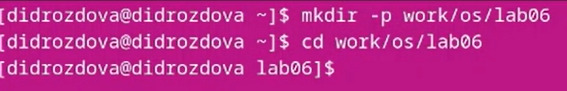
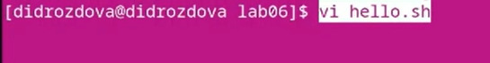
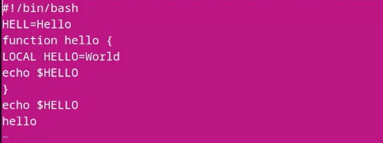
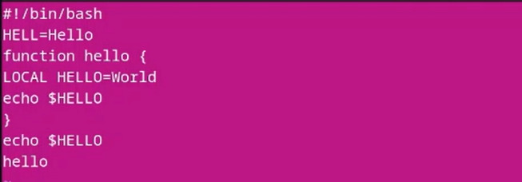
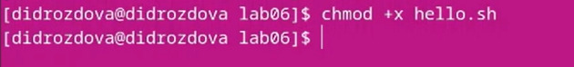
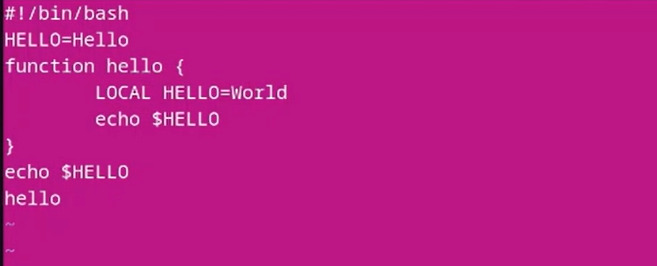
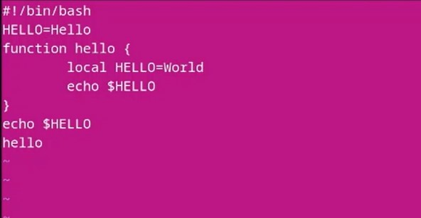
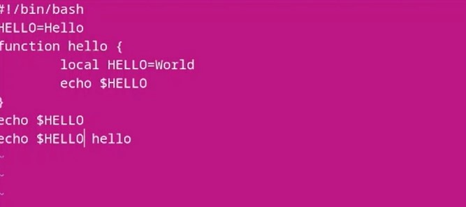
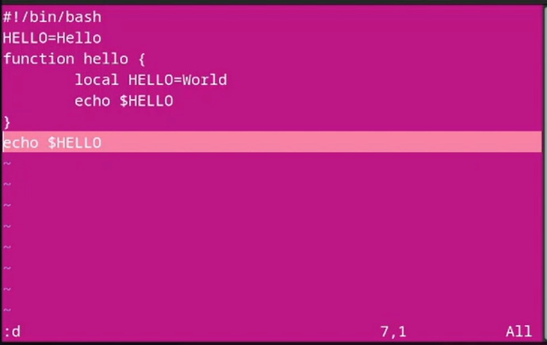
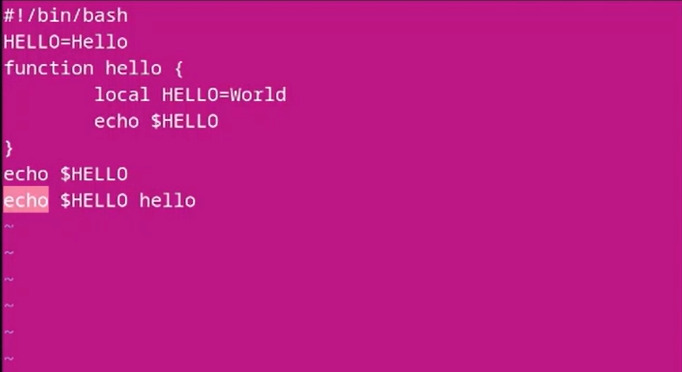

---
## Front matter
title: "Лабораторная работа №8"
subtitle: "Операционные системы"
author: "Дарья Игоревна Дроздова"

## Generic otions
lang: ru-RU
toc-title: "Содержание"

## Bibliography
bibliography: bib/cite.bib
csl: pandoc/csl/gost-r-7-0-5-2008-numeric.csl

## Pdf output format
toc: true # Table of contents
toc-depth: 2
lof: true # List of figures
lot: false # List of tables
fontsize: 12pt
linestretch: 1.5
papersize: a4
documentclass: scrreprt
## I18n polyglossia
polyglossia-lang:
  name: russian
  options:
	- spelling=modern
	- babelshorthands=true
polyglossia-otherlangs:
  name: english
## I18n babel
babel-lang: russian
babel-otherlangs: english
## Fonts
mainfont: PT Serif
romanfont: PT Serif
sansfont: PT Sans
monofont: PT Mono
mainfontoptions: Ligatures=TeX
romanfontoptions: Ligatures=TeX
sansfontoptions: Ligatures=TeX,Scale=MatchLowercase
monofontoptions: Scale=MatchLowercase,Scale=0.9
## Biblatex
biblatex: true
biblio-style: "gost-numeric"
biblatexoptions:
  - parentracker=true
  - backend=biber
  - hyperref=auto
  - language=auto
  - autolang=other*
  - citestyle=gost-numeric
## Pandoc-crossref LaTeX customization
figureTitle: "Рис."
tableTitle: "Таблица"
listingTitle: "Листинг"
lofTitle: "Список иллюстраций"
lotTitle: "Список таблиц"
lolTitle: "Листинги"
## Misc options
indent: true
header-includes:
  - \usepackage{indentfirst}
  - \usepackage{float} # keep figures where there are in the text
  - \floatplacement{figure}{H} # keep figures where there are in the text
---
# Цель работы

- Познакомиться с операционной системой Linux
- Получить практические навыки работы с редактором vi, установленным по умолчанию практически во всех дистрибутивах

# Задания

1. Ознакомиться с теоретическим материалом.
2. Ознакомиться с редактором vi.
3. Выполнить упражнения, используя команды vi.

# Выполнение лабораторной работы

1. **Создание нового файла с использованием vi**
  - Создайте каталог с именем ~/work/os/lab06 и перейдите в созданный каталог:
  
{#fig:001 width=70%}

  - Вызовите vi и создайте файл hello.sh:

{#fig:001 width=70%}

  - Нажмите клавишу i и введите листинг, представленный в приложении к лабораторной работе:
  
{#fig:001 width=70%}  
  
  - Нажмите клавишу Esc для перехода в командный режим после завершения ввода текста; нажмите *:* для перехода в режим последней строки и внизу вашего экрана появится приглашение в виде двоеточия; нажмите w (записать) и q (выйти), а затем нажмите клавишу Enter для сохранения вашего текста и завершения работы.

{#fig:001 width=70%}

  -  Сделайте файл исполняемым

{#fig:001 width=70%}

2. **Редактирование существующего файла**

  - Вызовите vi на редактирование файла, перейдите в режим вставки, нажав *i*, и замените на HELLO. Нажмите Esc для возврата в команд-
ный режим.:
  
{#fig:001 width=70%}

  - Установите курсор на четвертую строку и сотрите слово LOCAL, перейдите в режим вставки, нажав *i*, и наберите следующий текст: local, нажмите Esc для возврата в командный режим.

{#fig:001 width=70%}

  - Установите курсор на последней строке файла. Вставьте после неё строку, содержащую следующий текст: echo $HELLO, нажав *Enter ;* и *l*:

{#fig:001 width=70%}
  
  - Нажмите Esc для перехода в командный режим, удалите последнюю строку, выделив строку курсором и нажав *Enter ;* и *d*:
  
 {#fig:001 width=70%}
  
  - Введите команду отмены изменений u для отмены последней команды, затем введите символ : для перехода в режим последней строки, запишите произведённые изменения(wq) и выйдите из vi:
  
 {#fig:001 width=70%}
  
# Выводы
В ходе выполнения данной лабораторной работы мы ознакомились с операционной системой Linux и приобрели gрактические навыки работы с редактором vi, установленным по умолчанию практически во всех дистрибутивах.
