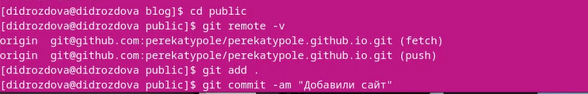

---
## Front matter
lang: ru-RU
title: Индивидуальный проект. Этап №1
subtitle: Операционные системы
author:
  - Дроздова Д. И.
institute:
  - Российский университет дружбы народов, Москва, Россия

## i18n babel
babel-lang: russian
babel-otherlangs: english

## Formatting pdf
toc: false
toc-title: Содержание
slide_level: 2
aspectratio: 169
section-titles: true
theme: metropolis
header-includes:
 - \metroset{progressbar=frametitle,sectionpage=progressbar,numbering=fraction}
 - '\makeatletter'
 - '\beamer@ignorenonframefalse'
 - '\makeatother'
---

# Информация

## Докладчик

  * Дроздова Дарья Игоревна
  * студентка НБИ-01
  * Российский университет дружбы народов

## Цели и задачи

- Размещение на Github pages заготовки для персонального сайта.

## Материалы и методы

- Необходимое программное обеспечение.
- Шаблон темы сайта Hugo Academic Theme
- Генератор статических сайтов Hugo
- Общие файлы для тем Wowchemy

## Задание

   - Установить необходимое программное обеспечение.
   - Скачать шаблон темы сайта.
   - Разместить его на хостинге git.
   - Установить параметр для URLs сайта.
   - Разместить заготовку сайта на Github pages.

# Выполнение первого этапа проекта

## Установим генератор статических сайтов Hugo по ссылке [https://github.com/gohugoio/hugo/releases](https://github.com/gohugoio/hugo/releases):

   {#fig:001 width=70%}

   Выбираем расширенную версию
   
## После загрузки распаковываем zip-файл и из каталога ~/Загрузки/hugo_extended_0.110.0_Linux-64bit вырезаем *hugo*:

{#fig:003 width=70%}

## Клонируем репозиторий по ссылке [https://github.com/wowchemy/starter-hugo-academic](https://github.com/wowchemy/starter-hugo-academic):

{#fig:003 width=70%}
    
## Переходим в каталог ~/work и создаем локальный репозиторий, созданный шагом ранее:
   
   {#fig:003 width=70%}
   
## Удаляем каталог  ~/work/blog/public и проверяем выполнение этого действия:
   
   {#fig:003 width=70%}
   
## Вводим ~/bin/hugo server, копируем сгенери рованную ссылку и открываем ее в браузере:

{#fig:003 width=70%}
    
## Переходим в ~/work/blog/content/_index.md и удаляем блок "block:hero" с 8 по 37 строчку и сохраняем файл:
   
   {#fig:003 width=70%}
   
   Теперь на нашем сайте пропал синий фон.
   
## Создаем новый репозиторий на гитхабе *username.github.io* и копируем на него ссылку:
   
   {#fig:003 width=70%}
   
## Переходим в ~/work и клонируем только что созданный репозиторий:
   
   {#fig:003 width=70%}
   
## Переходим в ~/work/username.github.io  и переключаемся на ветку main:

{#fig: width=70%}

##  Создаем README.MD, подготавливаем изменения к коммиту, создаем коммит и пушим изменения на сервер:
   
   {#fig:003 width=70%}
   
## Переходим в ~/work/blog и создаем подрепозиторий: 
   
   {#fig:003 width=70%}
   
## Редактируем файл *.gitignore* в ~/work/blog(ставим "#" перед *public*):
   
   {#fig:003 width=70%}
   
   - После выполнения предыдущего шага снова выполняем команду, которая позволит нам сделать наш сайт доступным для других машин:
   
   {#fig:003 width=70%}
   
## Проверяем соединение с репозиторием, подготовим изменения к коммиту, сделаем коммит и отправим изменения с локального репозиория:
   
   {#fig:003 width=70%}
   
   Первый этап индивидуального проекта выполнен.
   
# Выводы

Мы разместили на Github pages заготовки для персонального сайта.

