---
## Front matter
title: "Индивидуальный проект. Этап №1"
subtitle: "Операционные системы"
author: "Дроздова Дарья Игоревна"

## Generic otions
lang: ru-RU
toc-title: "Содержание"

## Bibliography
bibliography: bib/cite.bib
csl: pandoc/csl/gost-r-7-0-5-2008-numeric.csl

## Pdf output format
toc: true # Table of contents
toc-depth: 2
lof: true # List of figures
lot: false # List of tables
fontsize: 12pt
linestretch: 1.5
papersize: a4
documentclass: scrreprt
## I18n polyglossia
polyglossia-lang:
  name: russian
  options:
	- spelling=modern
	- babelshorthands=true
polyglossia-otherlangs:
  name: english
## I18n babel
babel-lang: russian
babel-otherlangs: english
## Fonts
mainfont: PT Serif
romanfont: PT Serif
sansfont: PT Sans
monofont: PT Mono
mainfontoptions: Ligatures=TeX
romanfontoptions: Ligatures=TeX
sansfontoptions: Ligatures=TeX,Scale=MatchLowercase
monofontoptions: Scale=MatchLowercase,Scale=0.9
## Biblatex
biblatex: true
biblio-style: "gost-numeric"
biblatexoptions:
  - parentracker=true
  - backend=biber
  - hyperref=auto
  - language=auto
  - autolang=other*
  - citestyle=gost-numeric
## Pandoc-crossref LaTeX customization
figureTitle: "Рис."
tableTitle: "Таблица"
listingTitle: "Листинг"
lofTitle: "Список иллюстраций"
lotTitle: "Список таблиц"
lolTitle: "Листинги"
## Misc options
indent: true
header-includes:
  - \usepackage{indentfirst}
  - \usepackage{float} # keep figures where there are in the text
  - \floatplacement{figure}{H} # keep figures where there are in the text
---

# Цель работы

Размещение на Github pages заготовки для персонального сайта.

# Задание

   - Установить необходимое программное обеспечение.
   - Скачать шаблон темы сайта.
   - Разместить его на хостинге git.
   - Установить параметр для URLs сайта.
   - Разместить заготовку сайта на Github pages.

# Выполнение первого этапа

1. **Установка необходимого программного обеспечения**

   - Установим генератор статических сайтов Hugo по ссылке [https://github.com/gohugoio/hugo/releases](https://github.com/gohugoio/hugo/releases):

   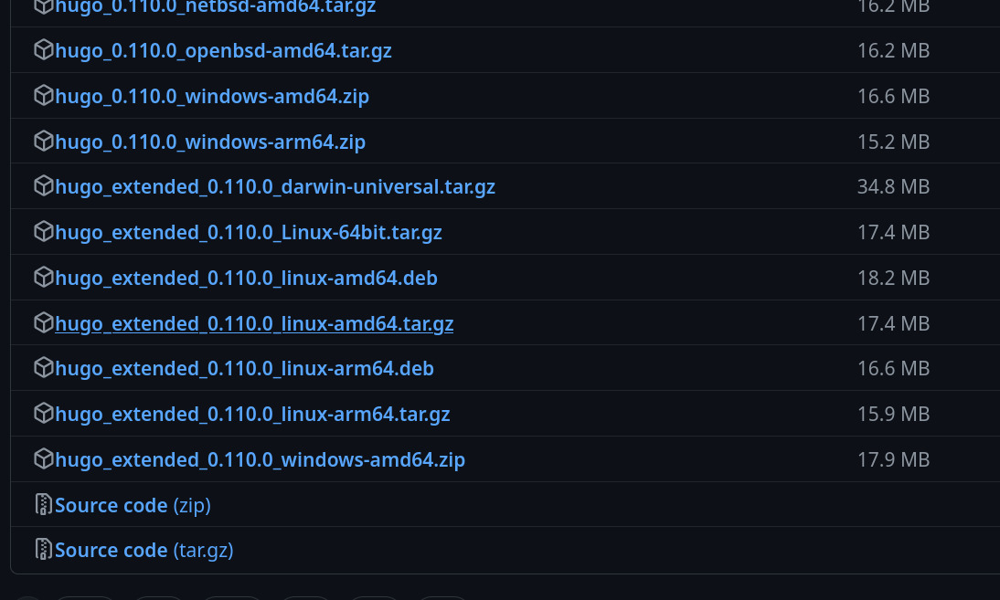{#fig:001 width=70%}

   Выбираем расширенную версию
   
   - После загрузки распаковываем zip-файл и из каталога ~/Загрузки/hugo_extended_0.110.0_Linux-64bit вырезаем *hugo*:
   
    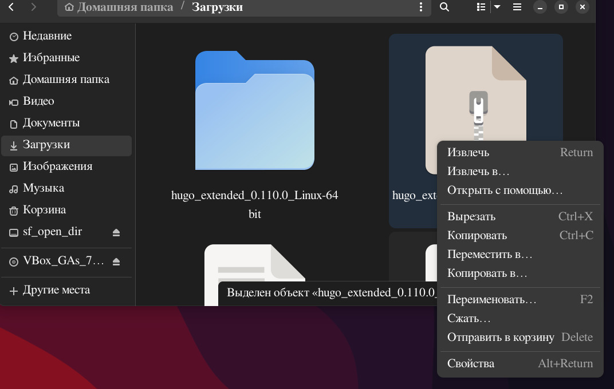{#fig:002 width=70%}
    
    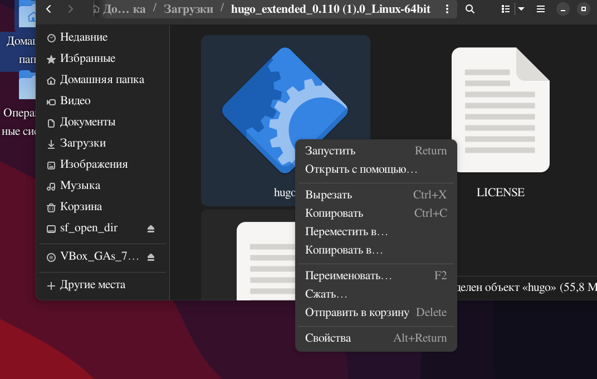{#fig:003 width=70%}
   
   - В каталоге ~/work создаем папку *bin* и переносим в него *hugo*:
   
    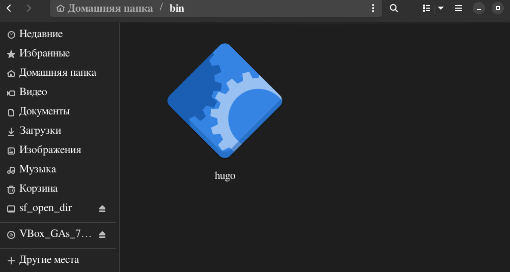{#fig:003 width=70%}
    
2. **Скачать шаблон темы сайта**

   - Клонируем репозиторий по ссылке [https://github.com/wowchemy/starter-hugo-academic](https://github.com/wowchemy/starter-hugo-academic):
   
    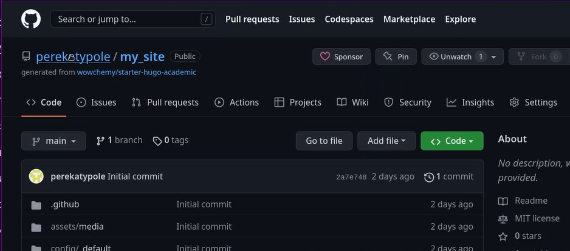{#fig:003 width=70%}
    
   - Переходим в каталог ~/work и создаем локальный репозиторий, созданный шагом ранее:
   
   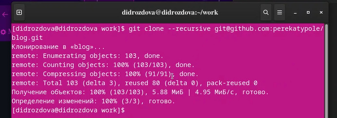{#fig:003 width=70%}
   
   - Удаляем каталог  ~/work/blog/public и проверяем выполнение этого действия:
   
   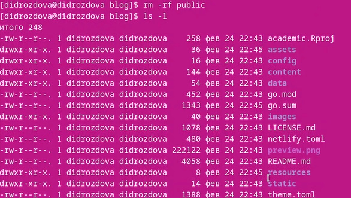{#fig:003 width=70%}
   
   - Вводим ~/bin/hugo server, копируем сгенери рованную ссылку и открываем ее в браузере:
   
    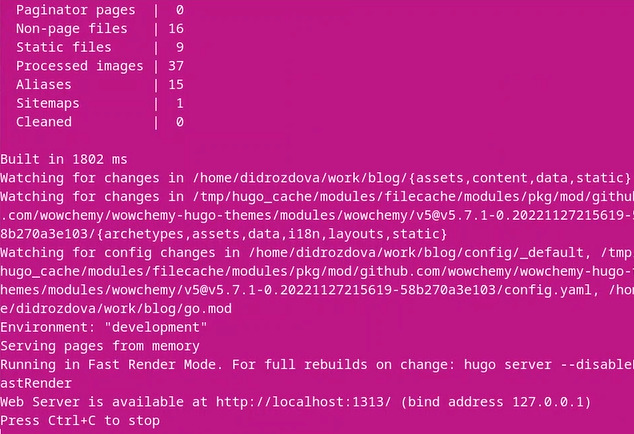{#fig:003 width=70%}
    
    Мы получили ссылку на сайт(пока сайт открывается только с нашего персонального компьютера).
    
   - Переходим в ~/work/blog/content/_index.md и удаляем блок "block:hero" с 8 по 37 строчку и сохраняем файл:
   
   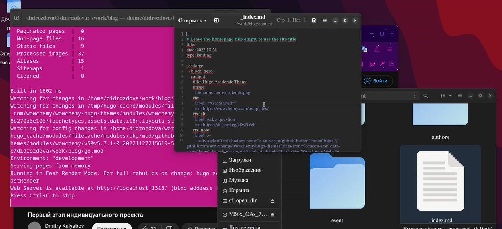{#fig:003 width=70%}
   
   Теперь на нашем сайте пропал синий фон.
   
   - Создаем новый репозиторий на гитхабе *username.github.io* и копируем на него ссылку:
   
   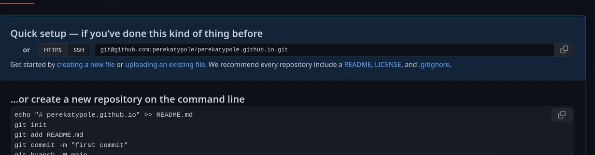{#fig:003 width=70%}
   
   - Переходим в ~/work и клонируем только что созданный репозиторий:
   
   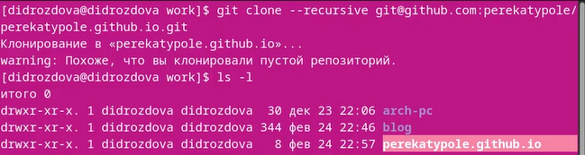{#fig:003 width=70%}
   
   - Переходим в ~/work/username.github.io  и переключаемся на ветку main:
   
    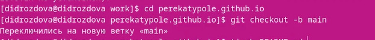{#fig:003 width=70%}

   - Создаем README.MD, подготавливаем изменения к коммиту, создаем коммит и пушим изменения на сервер:
   
   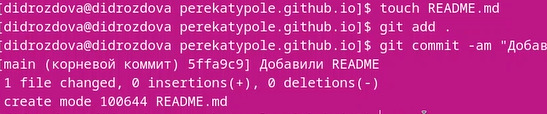{#fig:003 width=70%}
   
   - Переходим в ~/work/blog и создаем подрепозиторий: 
   
   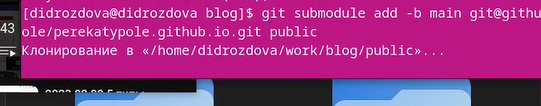{#fig:003 width=70%}
   
   - Редактируем файл *.gitignore* в ~/work/blog(ставим "#" перед *public*):
   
   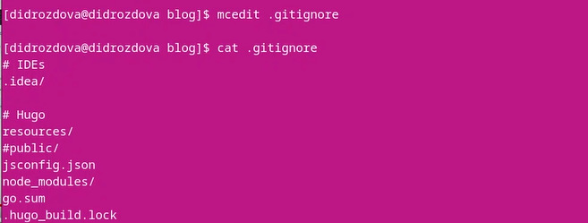{#fig:003 width=70%}
   
   - После выполнения предыдущего шага снова выполняем команду, которая позволит нам сделать наш сайт доступным для других машин:
   
   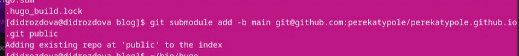{#fig:003 width=70%}
   
   - Проверяем соединение с репозиторием, подготовим изменения к коммиту, сделаем коммит и отправим изменения с локального репозиория:
   
   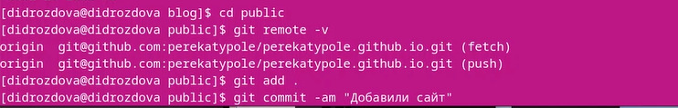{#fig:003 width=70%}
   
   Первый этап индивидуального проекта выполнен.
   
# Выводы

Мы разместили на Github pages заготовки для персонального сайта.

